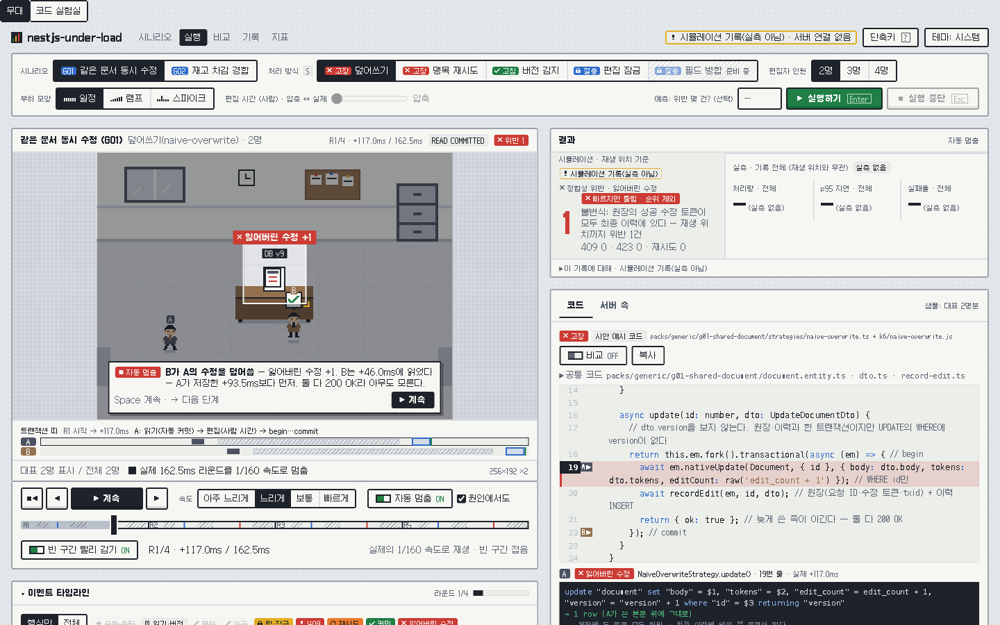
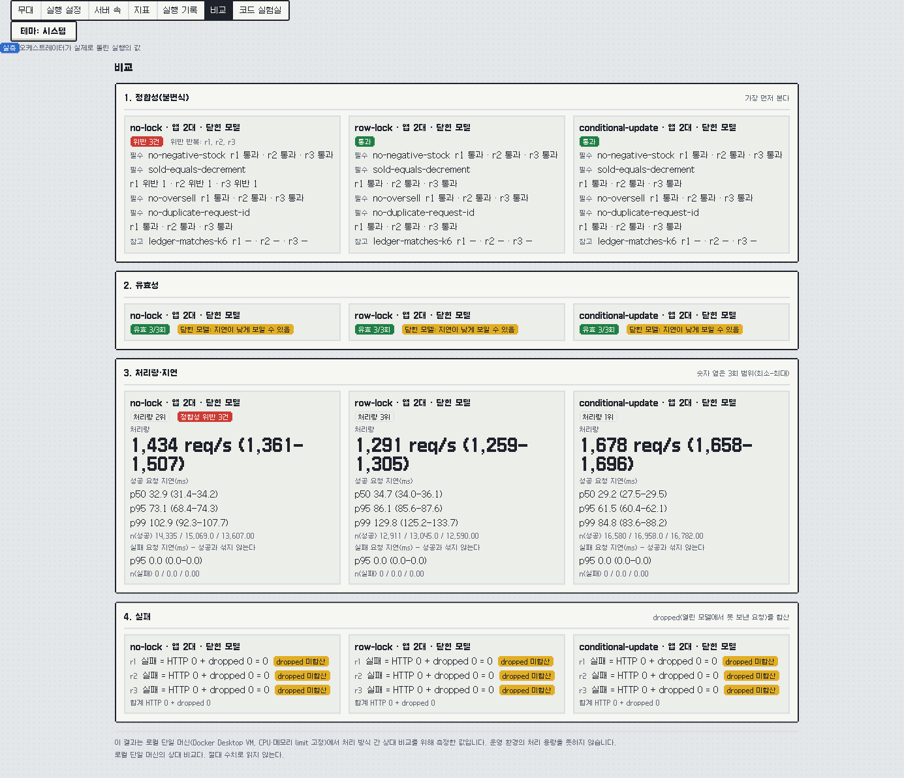
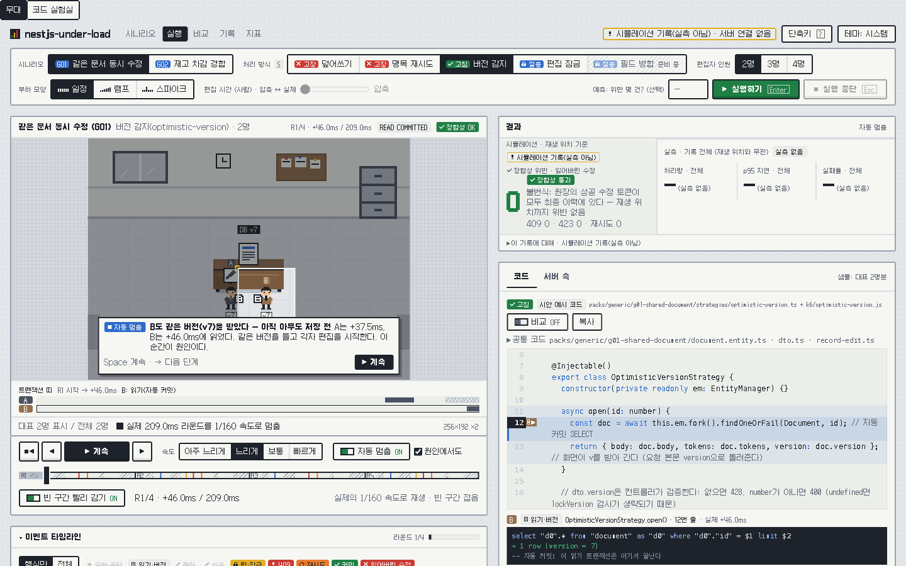
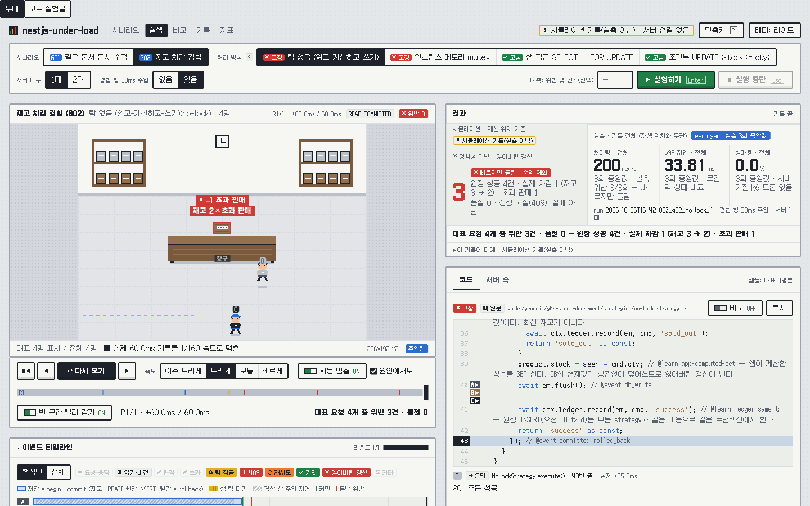
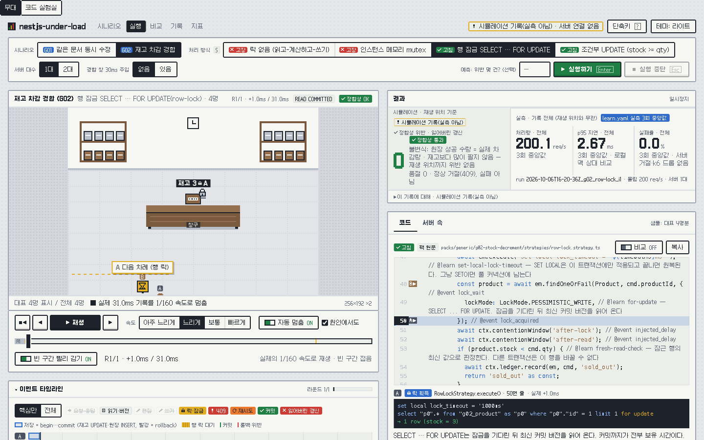
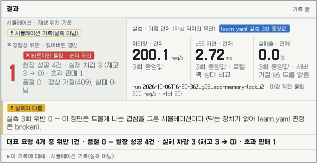
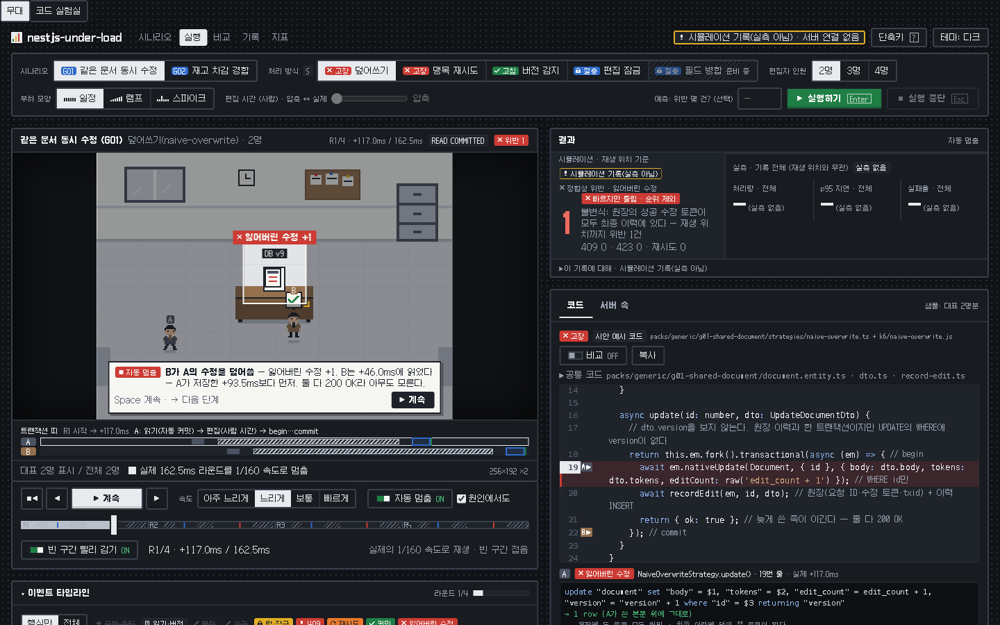

# nestjs-under-load

동시 요청·대량 쓰기·장애 상황에서 서버와 DB 안에서 실제로 무슨 일이 일어나는지 눈으로 보는 로컬 실험실입니다.

같은 API에 **처리 방식(strategy)만 바꿔 가며** 같은 조건에서 부하를 넣고, 정합성(잃어버린 수정, 중복, 초과 판매 등)과 지연·처리량을 나란히 비교합니다. 부하는 [k6](https://k6.io/)로 넣고, 결과는 실험 화면에서 봅니다.

> **로컬 전용입니다. 공용 네트워크·서버에 띄우지 마세요.** 모든 포트는 `127.0.0.1`에만 열립니다. 오케스트레이터 API와 Grafana(익명 Viewer)에는 인증이 없고, 사용자가 편집한 부하 스크립트를 실행하며 컨테이너를 재시작하는 권한이 있습니다. 외부에 노출하면 무방비입니다. 자세한 내용은 [보안 경고](#보안-경고)를 보세요.


*코드 실험실 — "경합 창 30ms 주입 · 서버 2대" 상황에서 `no-lock`(락 없음) 코드와 판정을 보는 화면. 판정 옆에 "실측"과 "주입됨" 배지가 붙습니다*



*무대 — 기록한 처리 단계를 느린 속도로 재생하다가, 잃어버린 수정 같은 핵심 순간에서 자동으로 멈춥니다*

> NestJS + MikroORM으로 구현하지만, 다루는 문제(락, 격리 수준, 커넥션 풀, 대량 쓰기, 캐시, 과부하, 비동기 일관성)는 DB·인프라 공통입니다.

## 목차

- [원칙](#원칙)
- [누가 짰나](#누가-짰나)
- [빠른 시작](#빠른-시작)
  - [1. 요구 사항](#1-요구-사항)
  - [2. 설치](#2-설치)
  - [3. 웹 화면만 보기](#3-웹-화면만-보기)
  - [4. 스택 띄우기](#4-스택-띄우기)
  - [5. 실행에서 비교까지](#5-실행에서-비교까지)
  - [6. 명령줄로 돌리기](#6-명령줄로-돌리기)
  - [7. 실측을 학습 데이터에 기록](#7-실측을-학습-데이터에-기록)
  - [8. 테스트](#8-테스트)
  - [9. 정리](#9-정리)
- [보안 경고](#보안-경고)
- [화면 보는 법](#화면-보는-법)
  - [화면 탭 7개](#화면-탭-7개)
  - [코드 실험실](#코드-실험실)
  - [무대(재생)](#무대재생)
  - [디자인 시안](#디자인-시안)
- [결과 읽는 법](#결과-읽는-법)
- [지금 들어 있는 시나리오](#지금-들어-있는-시나리오)
- [로드맵](#로드맵)
- [리포 구조](#리포-구조)
- [라이선스](#라이선스)

## 원칙

- **코드는 AI가, 학습은 사람이.** 처리 코드·불변식 SQL·인프라·화면은 전부 AI가 씁니다. 사람은 코드 실험실에서 "이 부하·상황에는 왜 이 코드가 들어가는가"를 학습하고, 실험 노트(예측 → 실측 → 원인)를 직접 씁니다. 경계는 [DESIGN §5.4](docs/DESIGN.md) 표로 공개합니다.
- **정합성이 먼저다.** 빠르지만 틀린 결과는 순위에서 뺍니다.
- **상대 비교만 말한다.** 로컬 단일 머신의 절대 수치는 운영 용량이 아닙니다. 결과에는 측정 조건을 함께 적습니다.
- **로컬 전용.** 사용자가 편집한 부하 스크립트를 실행하는 구조라서 외부에 노출하지 않습니다. 모든 포트는 `127.0.0.1`에만 열립니다.

## 누가 짰나

이 저장소의 코드는 **AI가 작성**했습니다. 이 저장소를 만든 사람은 코드를 쓰는 사람이 아니라 **학습자**입니다. 코드 실험실로 읽으며 배우고, 직접 쓰는 것은 실험 노트뿐입니다.

| 영역 | 작성 |
|---|---|
| 처리 코드(`packs/**/strategies`), `invariants.sql`, 엔티티·마이그레이션·시드, 엔진·오케스트레이터·인프라·웹 화면, k6 템플릿, 스크립트 | AI |
| `learn.yaml`의 `expected`(예상)·`why`·`choose` | AI (실측 전 추론이라 "예상" 배지가 붙습니다) |
| `learn.yaml`의 `measured`(실측) | 실행 결과에서 `scripts/measured.mjs`가 채웁니다. 사람도 AI도 손으로 쓰지 않습니다 |
| `docs/experiments/**` 실험 노트 | 사용자 (예측 → 실측 → 원인. 예측은 실행 전에 커밋) |

AI가 쓴 커밋에는 `Co-Authored-By` 트레일러가 붙습니다. 자세한 표는 [DESIGN §5.4](docs/DESIGN.md)에 있습니다.

## 빠른 시작

웹 화면만 볼 때는 Node와 pnpm만 있으면 됩니다. 실험을 직접 돌릴 때만 Docker가 필요합니다.

### 1. 요구 사항

| 항목 | 버전·사양 | 비고 |
|---|---|---|
| Node.js | 24 이상 | `package.json`의 `engines.node` |
| pnpm | 10 | `corepack enable`로 켜면 `packageManager`에 적힌 버전을 씁니다 |
| Docker Desktop | Compose v2 포함 | 실험 실행에만 필요 |
| Docker 자원 | **메모리 약 10GiB 이상**, vCPU 14개 기준 | 아래 설명 참고 |

**메모리:** 컨테이너 메모리 limit 합계가 기본 구성 약 5.8GiB, 관측(`obs`) 포함 약 7.8GiB, 전부(`obs`+`trace`) 약 9.1GiB입니다. Docker Desktop의 메모리를 10GiB 이상으로 올려 두세요. 프로필별 표는 [infra/compose/README.md](infra/compose/README.md)에 있습니다.

**vCPU가 14개보다 적을 때:** 기본값은 컨테이너를 서로 다른 CPU 집합에 고정(cpuset)합니다(k6 `0-1`, app·nginx `2-5`, postgres·redis `6-8`, 관측 `9-11`, 제어 `12-13`). Docker Desktop VM의 vCPU가 14개보다 적으면 없는 CPU 번호를 요구해서 컨테이너가 뜨지 않을 수 있습니다. 그때는 `infra/compose/.env`(아래 4-1)에서 값을 실제 vCPU에 맞추거나, 다음처럼 **비워 두세요.** 비우면 cpuset 없이 `cpus` 제한만 걸리고, 실행 메타데이터에 `cpuset: none`이 남습니다. cpuset이 없으면 k6와 실험 대상이 CPU를 다툴 수 있으므로, 이 상태의 결과는 기본 상태와 비교하지 않습니다.

```
CPUSET_K6=
CPUSET_APP=
CPUSET_DB=
CPUSET_OBS=
CPUSET_CTL=
```

**머신 차이:** Apple Silicon은 성능 코어·효율 코어 편차가, Linux 네이티브 Docker는 cpuset 의미 차이가 있습니다. 그래서 결과마다 측정 조건(CPU, Docker vCPU·메모리, 프로필)을 함께 남깁니다.

설치된 버전은 이렇게 확인합니다.

```bash
node -v      # v24.x
pnpm -v      # 10.x
docker compose version
```

### 2. 설치

```bash
git clone https://github.com/sinbox0701/nestjs-under-load.git nestjs-under-load
cd nestjs-under-load
pnpm install
```

예상 출력(마지막 줄):

```
Done in ...ms using pnpm v10.30.2
```

### 3. 웹 화면만 보기

Docker 없이 코드 실험실과 무대를 볼 수 있습니다. 코드 실험실은 저장소의 `packs/**/learn.yaml`과 처리 코드 원문을 빌드 때 읽어 옵니다.

```bash
pnpm --dir web dev
```

예상 출력:

```
  VITE v8.x  ready in ... ms
  ➜  Local:   http://127.0.0.1:5173/
```

- 무대: <http://127.0.0.1:5173/>
- 코드 실험실: <http://127.0.0.1:5173/#lab> (화면 위쪽 탭으로도 바꿀 수 있습니다)

5173 포트가 이미 쓰이고 있으면 Vite가 다음 빈 포트를 고르고, 출력에 그 주소를 보여 줍니다. 포트를 직접 정하려면 `pnpm --dir web dev --port 5190`처럼 붙입니다.

무대와 코드 실험실 밖의 탭(실행 설정·서버 속·지표·실행 기록·비교)은 오케스트레이터가 있어야 동작합니다. 오케스트레이터 없이 화면 모양만 보려면 주소에 `?mock`을 붙입니다(예: <http://127.0.0.1:5173/?mock#run>). 가짜 데이터이므로 실측이 아닙니다.

### 4. 스택 띄우기

실험은 docker compose 스택(오케스트레이터가 부하·DB 초기화·불변식 검사를 맡습니다)에서 돌립니다. 모든 서비스는 `infra/compose/docker-compose.yml` 하나에 있고, **프로필**로 묶여 있습니다.

| 프로필 | 서비스 | 화면·주소 |
|---|---|---|
| (기본) | app(최대 3대, 활성 2대), nginx, postgres, **redis**, k6, orchestrator, socket-proxy, web | 웹 <http://127.0.0.1:8080>, 오케스트레이터 API `127.0.0.1:4000`, nginx(수동 호출용) `127.0.0.1:8081` |
| `obs` | prometheus, grafana, postgres·redis·nginx exporter, cadvisor | Grafana <http://127.0.0.1:3001> (지표 탭이 임베드합니다) |
| `trace` | tempo, loki, alloy | 추적·로그. 계측 수준 `full`에서 쓰입니다 |

프로필이 다르면 실행 결과를 비교하지 않습니다(메타데이터 `stack.profiles`가 비교 조건입니다).

**4-1. (선택) 설정 파일.** DB 비밀번호와 cpuset 기본값은 로컬 전용입니다. 바꾸려면 `infra/compose/.env.example`을 `infra/compose/.env`로 복사해 고칩니다.

```bash
cp infra/compose/.env.example infra/compose/.env
```

**4-2. 기동.** 관측까지 함께 띄우는 것을 권합니다(지표 탭, 스크레이프 누락 판정, Grafana 주석이 `obs`에 기대고 있습니다).

```bash
docker compose -f infra/compose/docker-compose.yml --profile obs up -d --build --wait
```

기본 구성만 띄우려면 `--profile obs`를 뺍니다. 추적·로그까지 보려면 `--profile obs --profile trace`를 줍니다. `--wait`는 서비스가 healthy가 될 때까지 기다렸다가 돌아옵니다.

- **redis는 기본 구성에 들어 있습니다.** Redis를 쓰는 처리 방식(`redis-lock` 등)이 있고, 실행 메타데이터의 `images.redis`는 redis가 떠 있어야 채워집니다. redis 없이 띄우면 그 칸이 비어 "미채움"으로 보고됩니다.
- **`ORCHESTRATOR_URL`:** app은 이 값이 있으면 오케스트레이터에서 RunConfig를 받아오고(기본 `http://orchestrator:4001`), 값이 비어 있으면 파일(`runs/_active/run-config.json`)을 읽습니다. 화면·API 경로에서는 건드리지 않습니다. 6-4의 `scripts/run.mjs`를 쓸 때만 비워서 실행합니다.
- **프로젝트 이름:** 기본 프로젝트 이름은 `nestjs-under-load`입니다. `docker compose -p <이름>`으로 바꿔 띄우면 같은 값을 `COMPOSE_PROJECT_NAME`으로도 export 하세요(오케스트레이터가 app 컨테이너를 찾는 라벨, Alloy 로그 필터가 이 이름을 씁니다).

  ```bash
  export COMPOSE_PROJECT_NAME=내이름
  docker compose -p "$COMPOSE_PROJECT_NAME" -f infra/compose/docker-compose.yml --profile obs up -d --build --wait
  ```

- **git worktree에서 띄울 때:** 오케스트레이터는 레포를 읽기 전용으로 마운트해서 git 커밋 SHA와 변경 여부를 읽습니다. worktree의 `.git`은 컨테이너 밖 경로를 가리켜서 읽을 수 없으므로, 그때는 호스트에서 값을 export 합니다. 일반 `git clone`에서는 필요 없습니다. 값이 없으면 SHA는 `unknown`으로 기록됩니다.

  ```bash
  export GIT_SHA=$(git rev-parse HEAD)
  export GIT_DIRTY=$([ -z "$(git status --porcelain)" ] && echo false || echo true)
  ```

기동이 끝나면 <http://127.0.0.1:8080>을 엽니다. 정적 구성 검사(포트 바인딩·망·소켓 마운트)는 `node infra/compose/check-config.mjs`로 합니다.

### 5. 실행에서 비교까지

학습 흐름은 이렇습니다. 화면 위쪽 탭을 왼쪽에서 오른쪽으로 따라가면 됩니다.

1. **코드 실험실에서 예상을 읽습니다.** 상황(서버 대수, 경합 창 등)을 고르고, 처리 방식마다 "맞음·깨짐·느림"이 왜 그렇게 예상되는지 봅니다(`예상` 배지).
2. **실행 설정에서 예측을 적고 실행합니다.** 시나리오·처리 방식(여러 개 가능)·앱 대수·부하·데이터·계측 수준을 고르고, 맨 아래에 **예측 한 줄**(필수)을 씁니다. `실행`을 누르면 세션이 시작됩니다.
3. **서버 속에서 진행을 봅니다.** 실행 중인 요청의 처리 단계 타임라인, 락 차단 트리, 커넥션 풀 게이지가 실시간으로 나옵니다.
4. **지표에서 Grafana 대시보드를 봅니다**(`obs` 프로필 필요).
5. **실행 기록에서 끝난 실행을 고릅니다.** 같은 세션의 배치를 체크하고 비교로 보냅니다.
6. **비교에서 정합성부터 읽습니다.** 불변식 결과가 처리량보다 위에 나옵니다. 조건이 다른 두 실행은 "비교 불가"로 표시됩니다. 앱 대수처럼 일부러 바꾼 조건은 비교 축으로 지정해야 합니다.
7. **코드 실험실로 돌아가 예상과 실측을 견줍니다.** 실측을 학습 데이터에 기록하면(7절) 근거 배지가 "예상"에서 "실측 run#…"으로 바뀝니다.
8. **실험 노트를 씁니다**(사용자 몫). 양식은 [실험 노트 양식](docs/EXPERIMENT_TEMPLATE.md)입니다.



*비교 화면 — 정합성(불변식)이 가장 위에 있고, 위반이 있는 처리 방식에는 "정합성 위반" 표시가 붙어 처리량 순위에서 제외됩니다*

**비교가 "비교 불가"일 때.** 같은 처리 방식 그룹 안에서 파라미터가 다르면(`strategy.params`, `timeouts.lockMs`) 막히고, 처리 방식 id가 서로 다르면 이 두 항목은 비교 조건에서 제외합니다.

**프로브 끄기 비교.** PG 락 프로브를 켠 실행과 끈 실행을 `pgProbe.enabled` 축으로 비교할 때는 프로브 간격(`intervalMs`)을 같은 값으로 두세요. 간격이 다르면 비교 조건이 달라져 막힙니다.

### 6. 명령줄로 돌리기

화면 없이 같은 오케스트레이터 API를 부르는 스크립트들이 `scripts/` 아래에 있습니다. 모두 스택(4절)이 떠 있어야 하고, 기본 주소는 `http://127.0.0.1:4000`입니다.

**6-1. 1단계 완료 기준 재현.** 기준 1~6(G02 정합성·앱 1대 대 2대·메타데이터 완결성·무효 판정·dropped 합산)을 순서대로 실행하고 증거 JSON을 `runs/_acceptance/<시각>.json`에 남깁니다. 실패한 기준은 고치지 않고 원인 단서와 함께 기록합니다.

```bash
node scripts/acceptance/phase1.mjs
```

기준 5(k6 포화 → 무효)만은 k6 컨테이너의 cpus를 일부러 0.2로 낮춰 띄운 뒤 따로 돌립니다. 끝나면 override 없이 k6를 다시 띄웁니다.

```bash
docker compose -f infra/compose/docker-compose.yml -f scripts/acceptance/k6-cpu-0.2.override.yml --profile obs up -d k6
node scripts/acceptance/phase1.mjs --only c5 --out runs/_acceptance/c5.json
docker compose -f infra/compose/docker-compose.yml --profile obs up -d k6
```

단계 목록과 옵션은 `node scripts/acceptance/phase1.mjs --help`로 봅니다. 노트 재료용 단계도 있습니다(`--only probe,g01`: G02 PG 락 프로브 켜기/끄기 대조, G01 처리 방식 5개).

**6-2. 학습 데이터의 상황 전부 실측.** `learn.yaml`에 적힌 상황(서버 대수·부하·데이터·지연 주입)을 그대로 요청으로 바꿔 돌립니다. 먼저 요청만 확인합니다.

```bash
node scripts/acceptance/situations.mjs --dry-run
node scripts/acceptance/situations.mjs --only g02
```

세션 id가 `runs/_situations/<시각>.json`에 남습니다. 이 스크립트는 `learn.yaml`을 고치지 않습니다. 7절의 `measured.mjs`로 세션마다 기록합니다.

**6-3. 계측 오버헤드 측정.** 계측 수준(`off`·`metrics`·`full`)이 얹는 비용을 재서 [docs/overhead.md](docs/overhead.md)에 기록합니다. `obs`와 `trace` 프로필이 필요합니다.

```bash
docker compose -f infra/compose/docker-compose.yml --profile obs --profile trace up -d --build
node scripts/overhead/run.mjs --explore --rates 300,500,600
node scripts/overhead/run.mjs --rate-low 400 --rate-high 400
node scripts/overhead/run.mjs --render runs/_overhead/<시각>_main.json
```

**6-4. 0단계 실행기 `scripts/run.mjs`.** 오케스트레이터 없이 호스트에서 `docker compose`를 불러 직접 돌리는 최소 경로입니다. RunConfig를 오케스트레이터가 아니라 파일로 전달하므로 **`ORCHESTRATOR_URL`을 비워서** 실행합니다. 1단계 스택(오케스트레이터 포함)이 이미 떠 있다면 먼저 내리세요(9절). 이 스크립트가 하는 일:

1. app 이미지 빌드, postgres·k6·nginx 기동
2. 실행마다 DB를 템플릿에서 새로 복제(초기화)
3. 처리 방식을 담은 RunConfig를 기록하고 app 재시작
4. k6 웜업(별도 실행) → k6 본 실행
5. 불변식 SQL(`invariants.sql`)로 DB에 남은 사실을 검사
6. 결과를 `runs/<runId>/`에 저장, 같은 조건을 3회 반복

먼저 무엇을 할지 봅니다(dry-run, Docker를 부르지 않고 단계와 명령만 출력합니다).

```bash
node scripts/run.mjs --dry-run --strategies no-lock --reps 1
```

예상 출력(앞부분):

```
세션 2026-10-06T16-45-55Z_ebd6: ... (DRY-RUN)
  - no-lock × 앱 2대 × r1

▶ 스택 준비: app 이미지 빌드, postgres·k6·nginx 기동
```

전체 옵션은 `node scripts/run.mjs --help`로 봅니다. 아래 명령은 학습 데이터의 "몰림 200 req/s · 서버 1대"와 "마감 직전 몰림 200 req/s · 서버 2대" 상황에 맞춘 예입니다. 처리 방식 4개 × 앱 1대·2대 × 3회 = 24회를 돌립니다.

```bash
ORCHESTRATOR_URL= node scripts/run.mjs --rate 200 --duration 20s --warmup 5s --max-vus 2000 --instances 1,2
```

- `--rate 200`: 초당 200건을 일정하게 보냅니다(open model — 응답을 기다리지 않고 정해진 속도로 요청을 넣는 방식).
- `--max-vus 2000`: k6가 동시에 쓸 수 있는 가상 사용자 수 상한입니다. 도착률 × 요청 타임아웃(200 × 10s) 이상이어야 요청을 못 보낸 경우를 "서버가 늦어서"로 셀 수 있습니다. 작으면 그 실행은 "설정 부족"으로 무효가 됩니다.
- 경합 창을 넓혀 보려면 `--inject-delay after-read:30`을 더합니다(읽은 직후 30ms 인위 지연, 결과에 "주입됨"으로 남습니다). 학습 데이터의 "경합 창 30ms 주입" 상황(200 req/s × 20s, 상품 5개 × 재고 100)과 같은 조건이므로, 한 처리 방식·서버 2대·1회만 빠르게 확인하려면 이렇게 돌립니다.

```bash
ORCHESTRATOR_URL= node scripts/run.mjs --rate 200 --duration 20s --warmup 5s --max-vus 2000 --instances 2 --strategies no-lock --reps 1 --inject-delay after-read:30
```

실행마다 마지막에 요약 한 줄이 찍힙니다. 위반이 없으면 `불변식: 모두 통과`로, 있으면 위반 이름과 개수가 나옵니다.

```
    불변식: 모두 통과 | k6 성공 ... 품절 ... 실패 0 드롭 0 | k6 CPU 0.04×limit | 유효
    불변식: 위반 sold-equals-decrement=5, no-oversell=5 | k6 성공 1091 품절 2910 실패 0 드롭 0 | k6 CPU 0.043×limit | 유효
```

(아래 줄이 위 `no-lock` 30ms 주입 명령의 실제 출력입니다.) 끝나면 세션 요약 파일 경로가 나옵니다.

```
완료: 24회 → runs/_sessions/<sessionId>.json
```

위 빠른 확인 명령은 `완료: 1회 → ...`로 끝납니다.

**결과 위치.** `runs/`는 git에 올라가지 않는 로컬 산출물입니다.

| 경로 | 내용 |
|---|---|
| `runs/<runId>/metadata.json` | 측정 조건, 불변식 결과, k6 수치, 유효성 판정 |
| `runs/<runId>/summary.json` | k6 원본 요약 |
| `runs/<runId>/run-config.json` | 그 실행에 쓴 RunConfig |
| `runs/_sessions/<sessionId>.json` | 0단계 세션 전체 실행 목록 |
| `runs/_meta/lab.sqlite` | 1단계 오케스트레이터가 기록한 세션·배치·실행 |
| `runs/_acceptance/`, `runs/_situations/`, `runs/_overhead/` | 6-1~6-3 스크립트의 증거 |

`runId`는 `<시각>_g02_<처리 방식>_i<앱 대수>_r<반복 번호>` 형식입니다(예: `2026-10-06T16-20-36Z_g02_no-lock_i2_r1`).

### 7. 실측을 학습 데이터에 기록

세션 결과를 `learn.yaml`의 `measured`에 옮깁니다(오케스트레이터는 레포에 쓰지 않으므로 호스트에서 이 스크립트가 합니다). 세션 id는 6-4의 `runs/_sessions/`(0단계) 또는 화면·API 세션(1단계, `runs/_meta/lab.sqlite`)의 것을 씁니다. 먼저 `--write` 없이 무엇을 쓸지 확인합니다.

```bash
node scripts/measured.mjs --session <sessionId>
```

예상 출력(위 빠른 확인 명령의 세션이라면):

```
- no-lock × contention-window-30-two-instances: 경합 창 30ms 주입됨 · 위반 1/1회 발생(sold-equals-decrement 상품 5개, no-oversell 상품 5개) · 원장 성공 1091건 / 총재고 500 · 처리량 200.1 req/s(...) · p95 34.61ms(...) · 실패율 0%(0~0) · 로컬 맥 상대 비교
(--write 없이 실행: 파일을 바꾸지 않음)
```

전체 24회 세션이면 처리 방식 × 상황 묶음마다 한 줄씩 나오고 `3회`로 집계됩니다. 이 스크립트에는 `--help`가 없습니다(알 수 없는 옵션이라 실패). 옵션은 `--session`, `--write`, `--runs`뿐입니다. 내용이 맞으면 기록합니다.

```bash
node scripts/measured.mjs --session <sessionId> --write
```

조건(앱 대수, 도착률, 데이터 크기, 지연 주입)이 학습 데이터의 상황과 정확히 맞는 묶음만 기록되고, 무효 실행은 집계에서 빠집니다. 같은 상황에 이미 3회 실측이 들어 있으면 `--write`가 그 값을 새 세션 값으로 바꿉니다. 반복 1회짜리 확인 세션은 `--write` 없이 출력만 확인하세요.

웹 dev 서버를 다시 열거나 새로고침하면, 코드 실험실 판정 패널의 근거 배지가 "예상"에서 "실측 run#…"으로 바뀝니다.

### 8. 테스트

```bash
pnpm typecheck && pnpm test
```

게이트(`pnpm typecheck && pnpm test`)는 PG·Redis·Docker 없이 돕니다. PG·Redis가 필요한 통합 테스트는 **명시한 환경변수가 있을 때만** 실행하고, 없으면 접속 시도 없이 건너뜁니다. 실행 중인 compose 스택의 기본 포트(55432, 6379)에 자동으로 붙지 않습니다. 통합 테스트를 돌리려면 일회용 컨테이너를 띄우고 그 주소를 env로 줍니다(테스트가 `CREATE DATABASE`를 하므로 스택의 DB를 가리키지 마세요).

| 환경변수 | 대상 |
|---|---|
| `G02_TEST_DATABASE_URL` | G02 팩 통합 테스트(PG) |
| `G02_TEST_REDIS_URL` | G02 `redis-lock` 통합 테스트(Redis) |
| `G01_TEST_DATABASE_URL` | G01 팩 통합 테스트(PG) |
| `APP_TEST_DATABASE_URL` | app 템플릿 준비 통합 테스트(PG) |

```bash
docker run -d --rm --name nul-test-pg -e POSTGRES_PASSWORD=pw -p 127.0.0.1:55499:5432 postgres:17
docker run -d --rm --name nul-test-redis -p 127.0.0.1:56379:6379 redis:8.2.1-alpine
G02_TEST_DATABASE_URL=postgresql://postgres:pw@127.0.0.1:55499/postgres \
G01_TEST_DATABASE_URL=postgresql://postgres:pw@127.0.0.1:55499/postgres \
APP_TEST_DATABASE_URL=postgresql://postgres:pw@127.0.0.1:55499/postgres \
G02_TEST_REDIS_URL=redis://127.0.0.1:56379 \
pnpm test
docker stop nul-test-pg nul-test-redis
```

### 9. 정리

```bash
docker compose -f infra/compose/docker-compose.yml --profile obs --profile trace down
```

프로필을 붙인 채 내려야 그 프로필의 서비스까지 내려갑니다. DB 볼륨까지 지우려면 `down -v`를 씁니다. 다음 실행 때 템플릿 DB를 다시 만듭니다.

## 보안 경고

- **공용 네트워크·서버에 띄우지 마세요.** 이 스택은 내 머신 안에서만 쓰도록 만들었습니다.
- 모든 호스트 포트는 `127.0.0.1`에만 바인딩됩니다(web 8080, 오케스트레이터 4000, nginx 8081, Grafana 3001, postgres 55432). `0.0.0.0`으로 바꾸지 마세요.
- **오케스트레이터 API에는 인증이 없습니다.** 실행을 시작하고 컨테이너를 재시작·중지할 수 있습니다. 요청의 `Origin`·`Host`는 로컬 주소만 허용하지만, 이것은 브라우저 경유 공격을 줄이는 장치일 뿐 인증이 아닙니다.
- **Grafana는 익명 Viewer로 열려 있습니다**(읽기 전용, 로그인 없음). 실행 주석은 오케스트레이터가 서비스 계정 토큰으로 씁니다.
- 사용자가 편집한 k6 스크립트를 실행합니다. k6 컨테이너는 인터넷으로 나가는 경로가 없는 내부 망(`internal: true`)에만 붙어 있습니다.
- Docker 소켓은 `socket-proxy`·`alloy`(읽기)·`cadvisor`(읽기) 컨테이너만 마운트합니다. 오케스트레이터는 소켓 대신 `socket-proxy`를 거치고, 프록시는 컨테이너 조회와 `start`·`stop`·`restart`·`kill`만 통과시킵니다(생성·exec·이미지 API는 403).
- DB 비밀번호 등은 `.env.example`의 **로컬 전용 기본값**입니다. 실제 비밀 정보가 아닙니다. 실제 비밀번호를 이 파일이나 저장소에 넣지 마세요.

전체 마운트 목록과 완화책은 [DESIGN §13](docs/DESIGN.md)에 있습니다.

## 화면 보는 법

### 화면 탭 7개

웹은 위쪽 탭 7개로 나뉩니다. 주소의 `#` 뒤 이름으로도 바로 갈 수 있습니다(예: `/#compare`).

| 탭 | 주소 | 하는 일 | 필요한 것 |
|---|---|---|---|
| 무대 | `/` | 시나리오를 골라 처리 단계를 느린 속도로 재생해 보기(시뮬레이션) | 없음 |
| 실행 설정 | `/#run` | 시나리오·처리 방식·앱 대수·부하·데이터·계측 수준·예측을 정하고 실제로 실행 | 오케스트레이터 |
| 서버 속 | `/#live` | 실행 중인 요청의 처리 단계 타임라인, 락 차단 트리, 커넥션 풀 게이지 | 오케스트레이터 |
| 지표 | `/#metrics` | 그 실행의 Grafana 대시보드(개요·RED·USE-앱·USE-PG·부하)를 임베드 | 오케스트레이터 + `obs` 프로필 |
| 실행 기록 | `/#history` | 끝난 실행 목록. 골라서 비교로 보내기 | 오케스트레이터 |
| 비교 | `/#compare` | 정합성(불변식)을 처리량보다 먼저 두고 실행끼리 견주기. 조건이 다르면 "비교 불가" | 오케스트레이터 |
| 코드 실험실 | `/#lab` | 상황별로 어떤 코드가 왜 맞고 틀리는지 읽기, "예상"과 "실측" 구분 | 없음 |

무대와 코드 실험실은 저장소 안의 기록·학습 데이터만 읽으므로 Docker 없이 보입니다. 화면 위쪽에 "시뮬레이션"(무대)과 "실측"(서버 속·비교) 배지가 붙어, 가상 기록과 실제 실행값을 섞어 읽지 않게 합니다. 아래에서는 코드 실험실과 무대를 자세히 설명합니다. 실행 설정·서버 속·지표·실행 기록·비교는 위 5절의 흐름을 따라가면 됩니다.


### 코드 실험실

IDE처럼 생긴 학습 화면입니다. 코드는 읽기 전용입니다.

**구성**

- **탐색기(왼쪽):** 시나리오 폴더 트리입니다. `strategies/`(처리 방식별 코드), `invariants.sql`(정합성 검사), `k6/`(부하 스크립트), `learn.yaml`(학습 데이터)을 열 수 있습니다.
- **상황 선택 바(위):** `learn.yaml`에 정의된 상황(인원, 서버 대수, 지연 주입 조합) 칩입니다. 상황을 바꾸면 판정과 강조 줄이 함께 바뀝니다.
- **에디터(가운데):** 그 상황에서 봐야 할 줄을 빨간 띠와 거터 아이콘으로 강조합니다. 거터 아이콘에 마우스를 올리면 그 줄의 `// @learn` 설명이 뜹니다.
- **판정 패널(오른쪽):** 처리 방식별 판정, 근거 배지, 이유, 실행되는 SQL, 관련 개념, 결정 가이드를 보여 줍니다.
- **매트릭스(아래, `M`):** 처리 방식 × 상황 전체 표입니다.


*`// @learn` 마커 줄에 마우스를 올리면 "락 없이 읽은 값. 여기서 UPDATE까지가 경합 창" 같은 설명이 뜹니다*

**나란히 비교(`D`)** 를 켜면 같은 상황에서 두 처리 방식의 코드를 좌우로 놓습니다. diff가 아니라 "같은 문제를 다르게 푼 두 구현"을 비교하는 용도입니다.


*`no-lock`(읽고-계산하고-쓰기)과 `row-lock`(`SELECT … FOR UPDATE`)을 나란히 비교*

**판정 패널 읽기**


판정 배지는 네 가지입니다.

| 배지 | 뜻 |
|---|---|
| ✓ 맞음 (`ok`) | 정합성이 지켜지고 성능도 문제없음 |
| ✕ 깨짐 (`broken`) | 정합성 위반이 남(초과 판매, 차감 누락 등) |
| ⧗ 느림 (`slow`) | 정합성은 지키지만 대기·지연이 큼 |
| ⊘ 거절 (`rejects`) | 정합성은 지키지만 일부 요청을 거절함(예: 락 대기 시간 초과로 503) |

근거 배지는 그 판정이 어디서 왔는지 알려 줍니다.

- **예상:** 아직 돌려 보지 않았고, PostgreSQL·ORM 동작과 부하 조건에서 추론한 값입니다(`learn.yaml`의 `expected`).
- **실측 run#…:** `run.mjs`로 실제로 돌린 결과입니다(`measured`). 배지에 마우스를 올리면 run id가 보이고, 패널에 3회 범위와 측정 조건이 붙습니다. 예상과 실측이 다르면 "예상이었던 것"을 함께 보여 줍니다.
- **주입됨:** 그 상황이 인위적 지연이나 장애를 넣은 조건이라는 뜻입니다. 자연 상태의 결과와 섞어 읽지 않도록 표시합니다.

그 아래로 차례대로 나옵니다.

- **왜?** 그 판정의 이유
- **이 상황에서 볼 줄:** 누르면 에디터가 그 줄로 이동
- **그 순간 나가는 SQL:** ORM이 실제로 보내는 문장의 예
- **관련 개념:** 잃어버린 갱신, 행 잠금, READ COMMITTED 재검사 등 한 단락 설명
- **이 상황이면 이 코드:** 결정 가이드(쓸 코드 / 피할 코드)

<br clear="right">

**매트릭스**


*매트릭스 — 셀을 누르면 그 상황·처리 방식으로 이동합니다. "실측" 표시가 있는 셀은 실제로 돌려 본 조합이고, "주입됨"이 함께 있으면 지연을 인위로 넣은 조건입니다. 실측이 없는 열(동시 2명, 핫 상품, DB 지연, 짧은 lock_timeout)은 아직 "예상"입니다*

**단축키** (`?`로 도움말을 엽니다. 에디터에 포커스가 있으면 꺼집니다)

| 키 | 동작 |
|---|---|
| `[` / `]` | 이전 / 다음 상황 |
| `J` / `K` | 다음 / 이전 처리 방식 |
| `1` – `9` | 처리 방식 바로 고르기 |
| `D` | 나란히 비교 켜기/끄기 |
| `M` | 매트릭스 보기 |
| `E` | 탐색기 접기/펴기 |
| `?` | 도움말 |
| `Esc` | 도움말 닫기 |

**다크 모드:** 오른쪽 위 "테마" 버튼으로 시스템 → 라이트 → 다크를 돌아가며 고릅니다.


*다크 모드 — "경합 창 30ms 주입 · 서버 2대" 상황. 상황 설명 옆에 "주입됨" 배지가 붙습니다*

### 무대(재생)

실제 처리는 밀리초 단위라 실시간으로는 읽을 수 없습니다. 무대는 처리 단계를 기록으로 만들어 **느린 속도로 재생**합니다. 캐릭터는 기록된 이벤트 사이에서만 움직이고, 이벤트 없이 상태를 바꾸지 않습니다.

`실행하기`는 서버나 DB를 호출하지 않습니다. 브라우저 안에서 규칙에 따라 기록을 만들어 재생합니다. 그래서 화면 위쪽에 "시뮬레이션 기록(실측 아님) · 서버 연결 없음" 표시가 붙습니다. 실제로 돌려 얻은 수치는 [결과 카드](#결과-카드)의 실측 영역에만 나옵니다.


*G01 덮어쓰기 — "B가 A의 수정을 덮어씀"에서 자동으로 멈춘 화면. 무대, 재생 바, 코드 패널의 강조 줄이 한 화면에 보입니다*

#### 설정 바

화면 맨 위 설정 바에서 고른 뒤 `실행하기`(`Enter`)를 누릅니다. 실행 중에는 설정을 바꿀 수 없고, `실행 중단`(`Esc`)으로 멈춥니다. 기록이 있을 때 설정을 바꾸면 같은 설정으로 기록을 다시 만들고, 재생은 멈춘 채로 둡니다.

| 항목 | 고를 수 있는 값 |
|---|---|
| 시나리오 | G01 같은 문서 동시 수정 · G02 재고 차감 경합 |
| 처리 방식(`S`로 순서대로 바꿈) | G01: 덮어쓰기 · 맹목 재시도 · 버전 감지 · 편집 잠금 (필드 병합은 "준비 중"으로 비활성)<br>G02: 락 없음 · 인스턴스 메모리 mutex · 행 잠금 `SELECT … FOR UPDATE` · 조건부 `UPDATE` |
| 편집자 인원(G01) | 2명 · 3명 · 4명 |
| 부하 모양(G01) | 일정 · 램프 · 스파이크 |
| 편집 시간(G01) | 압축 · 2초 · 30초 · 5분 슬라이더. 편집 잠금에서만 대가가 달라져서, 다른 방식에서는 흐리게 표시됩니다 |
| 서버 대수(G02) | 1대 · 2대 |
| 경합 창 30ms 주입(G02) | 없음 · 있음 |
| 예측: 위반 몇 건? | 선택 입력(0–99). 적으면 결과 카드에 "예측 N"이 붙고, 기록 끝에서 적중·빗나감을 알려 줍니다 |

#### 무대 장면

무대 위에는 현재 시나리오·처리 방식·인원, 격리 수준(`READ COMMITTED`), 재생 위치(`R1/4 · +46.0ms / 162.5ms`), 위반 배지(`정합성 OK` / `위반 N`)가 나옵니다. 무대 아래 띠에는 지금 장면에 걸린 사람별 트랜잭션이 요약됩니다.

**G01 — 같은 문서를 둘이 고칠 때**

두 사람(A, B)이 책상 위 문서를 열고, 각자 고친 뒤 저장합니다. 책상 위 `DB v7`은 DB에 있는 문서 버전입니다. 볼 곳은 두 군데입니다.

- **원인:** B도 A와 같은 버전(v7)을 받는 순간입니다. 아직 아무도 저장하기 전이라 이 시점에는 틀린 것이 없지만, 같은 버전을 들고 각자 편집을 시작합니다.
- **결과:** 덮어쓰기에서는 A가 v8을 저장한 뒤 B가 v9로 저장하면서 A의 수정이 사라집니다. 둘 다 200 OK를 받아서 아무도 모릅니다. 무대에 "잃어버린 수정 +1"이 뜹니다.



*G01 버전 감지 — "B도 같은 버전(v7)을 받았다"에서 멈춘 원인 장면. 코드 패널은 B가 읽은 줄을 가리킵니다*

**G02 — 재고 하나를 여럿이 살 때**

선반의 재고 상자(`재고 3`)와 창구, 그리고 줄 선 요청 A~D가 보입니다. 처리 방식에 따라 보이는 것이 다릅니다.

- **락 없음 + 경합 창 30ms 주입:** 둘이 같은 재고를 읽고 각자 계산한 값을 씁니다. 재고는 한 번만 줄어드는데 원장에는 성공이 여럿 남습니다. 기록 끝에 "초과 판매"가 붙습니다.
- **행 잠금:** 락을 쥔 요청 이름이 재고 상자 옆에 자물쇠와 함께 붙고, 기다리는 요청은 아래쪽 줄에서 순서를 기다립니다.



*G02 락 없음 + 경합 창 30ms 주입 — 기록 끝. 원장 성공 4건인데 실제 차감은 1이라 "초과 판매"로 표시됩니다*



*G02 행 잠금 — A가 락을 쥐고, B는 줄에서 기다립니다. 코드 패널은 락을 얻은 줄을 강조합니다*

#### 재생 바

| 컨트롤 | 설명 | 키 |
|---|---|---|
| 재생 · 일시정지 · 계속 · 다시 보기 | 자동 멈춤에서 이어 갈 때는 `계속`으로 바뀝니다 | `Space` |
| 한 단계씩 | 다음 / 이전 단계. 타임라인에 보이는 행 단위로 움직입니다 | `→` / `←` |
| 처음으로 | | `Home` |
| 속도 | 아주 느리게 1/400 · 느리게 1/160(기본) · 보통 1/80 · 빠르게 1/40. 실제 시간의 몇 분의 1 속도로 재생한다는 뜻입니다 | `1` – `4` |
| 자동 멈춤 | 충돌·잃어버린 수정·락 대기·잠금 거절 같은 핵심 순간에서 멈추고 설명 상자를 띄웁니다(기본 ON) | `A` |
| 원인에서도 | 자동 멈춤이 켜져 있을 때만 쓸 수 있습니다. 결과가 나기 전, 원인이 되는 순간(G01은 두 번째 사람이 같은 버전을 받는 때, G02는 같은 재고 값을 읽는 때)에서도 멈춥니다(기본 ON) | |
| 빈 구간 빨리 감기 | 이벤트가 없는 구간을 최대 0.3초로 접습니다. 접힌 구간은 막대에서 빗금으로 보입니다(기본 ON) | `F` |

재생 막대에는 라운드 구분(`R1`, `R2`…)과 충돌·락 대기·재시도·읽기 표시가 색 눈금으로 붙습니다. 막대 아래 왼쪽에는 `R1/4 · +46.0ms / 162.5ms`처럼 **라운드 시작부터 실제 경과 시간**이, 오른쪽에는 "실제의 1/160 속도로 재생"처럼 배율이 나옵니다. 막대에 마우스를 올리면 그 위치의 실제 시간이나 접힌 구간 길이가 뜹니다.

#### 코드 패널

무대 오른쪽 아래 `코드` 탭입니다. 이벤트가 난 순간의 코드 줄을 보여 줍니다.

- **강조 줄:** 지금 이벤트를 낸 줄을 색 띠로 칠합니다. 나쁜 순간은 빨강, 기다림은 노랑입니다.
- **A▶ B▶:** 줄 번호 옆 거터 표시는 사람(요청)마다 지금 어느 줄에 있는지 가리킵니다.
- **SQL:** 강조 줄 아래에 그 순간 나간 SQL과 영향 행 수(`→ 1 row`)가 붙습니다. 그 아래에 한 줄 설명이 나옵니다.
- **코드 출처:** G01은 시안용 "시안 예시 코드", G02는 팩의 strategy 원문("팩 원문")입니다. 공통 코드 파일(entity·dto 등)은 접힌 목록으로 보입니다.
- **비교(`C`):** 같은 시나리오의 다른 처리 방식 하나를 골라 두 코드를 위아래로 놓습니다. 같은 줄은 "공통 N줄 접음"으로 접고, 다른 줄에만 `+` / `−`를 붙입니다. 접힌 줄은 "펼치기"로 열 수 있습니다.
- **복사:** 지금 코드를 클립보드로 복사합니다.

#### 타임라인

무대 아래 "이벤트 타임라인"은 처리 단계를 시간순으로 보여 줍니다. 위에는 사람별 레인에 트랜잭션 띠가 그려집니다. 읽기(자동 커밋 `SELECT`), 편집(사람 시간, 빗금), 저장(`begin … commit`)이 서로 다른 구간임을 한눈에 봅니다.

- **보기 범위:** `핵심만` / `전체`로 거르고, 이벤트 종류(읽기·버전, 락·잠금, 409, 재시도, 커밋, 잃어버린 수정 등)별로 켜고 끕니다.
- **행:** 시간, 사람, 종류 배지, 한 줄 설명 순서입니다. 같은 사람의 같은 종류가 이어지면 `×N`으로 묶습니다. 행을 누르면 그 시점으로 이동해 멈춥니다. 현재 위치 행은 파란 띠로 강조됩니다.
- **시간:** 재생 시간이 아니라 라운드 시작부터의 실제 ms입니다. 편집 구간은 사람 시간을 줄여서 그립니다.


*이벤트 타임라인 — 레인의 트랜잭션 띠와 시간순 행. 원인(같은 버전)과 결과(잃어버린 수정)가 따로 보입니다*

#### 서버 속

코드 패널 옆 `서버 속` 탭입니다. 재생 위치의 서버·DB 안쪽 상태를 보여 줍니다.

- **격리 수준:** `READ COMMITTED` 같은 값과 "왜?" 설명
- **DB 행 락:** 락을 쥔 쪽과 기다리는 쪽. 덮어쓰기처럼 락이 없으면 "보유 중인 행 락 없음"
- **커넥션 풀:** 사용 중인 커넥션 수와 대기 수
- **현재 SQL:** 그 순간 나간 문장(파라미터는 마스킹)과 어느 사람의 것인지
- **DB 세션:** `pg_stat_activity` 샘플. 편집 중이거나 대기 중인 사람은 DB 세션을 잡지 않아 비어 있을 수 있습니다


*서버 속 — 덮어쓰기는 락도 버전 확인도 없어서 `update … where id = $3`이 그대로 1행을 바꿉니다*

#### 결과 카드

결과 카드는 두 영역으로 나뉩니다. 한쪽은 재생 위치에 따라 변하고, 다른 쪽은 변하지 않습니다.

| 영역 | 내용 | 재생 위치 |
|---|---|---|
| 시뮬레이션(왼쪽) | 정합성 위반 수, 판정 배지, 불변식 설명, G01은 409·423·재시도, G02는 품절 수 | 따라 변함. 재생 위치까지 센 값 |
| 실측(오른쪽) | 처리량 · p95 지연 · 실패율, 출처 배지, run id와 측정 조건 | 상관없음. 기록 전체 요약 |

위반 수가 가장 먼저, 가장 크게 나옵니다. 위반이 있으면 "빠르지만 틀림 · 순위 제외"가 붙고, 처리량·p95·실패율은 그 옆에 둡니다.

- **"시뮬레이션 기록(실측 아님)":** 이 장면의 이벤트 순서와 시각, 위반 수는 서버를 실제로 돌려 얻은 값이 아닙니다. 대표 요청 몇 개가 처리되는 모습을 규칙에 따라 만든 기록이고, 위반 수도 그 기록의 원장으로 셉니다. 카드의 "이 기록에 대해"를 펼치면 설명이 나옵니다.
- **G02 실측 영역:** `learn.yaml`에 기록된 실측 3회 중앙값입니다. 어느 run, 어떤 조건에서 쟀는지 카드 안에 적힙니다.
- **G01 실측 영역:** G01은 아직 실측 전이라 처리량·p95·실패율이 `—(실측 없음)`으로 나옵니다.
- **"실측과 다름":** 무대에서 본 시뮬레이션 장면과 실측의 판정이 어긋날 때 붙는 고지입니다. 아래 캡처는 서버 2대에서 인스턴스 메모리 mutex를 쓴 경우로, 시뮬레이션 장면은 위반 1이지만 실측 3회는 위반 0이었습니다. 장면은 드물게 나는 겹침을 고른 것이니 실측과 섞어 읽지 않도록 알려 줍니다.



*G02 인스턴스 메모리 mutex, 서버 2대 — 시뮬레이션 영역(위반 1)과 실측 영역(3회 중앙값)을 나누고, "실측과 다름"을 알립니다*

#### 단축키

`?`로 단축키 창을 엽니다. 입력칸에 글자를 쓰는 중이거나 `Ctrl`·`Cmd`·`Alt`를 함께 누르면 동작하지 않습니다. 버튼에 포커스가 있을 때 `Space`·`Enter`는 그 버튼을 누릅니다.

| 키 | 동작 |
|---|---|
| `Enter` | 실행하기 (기록 만들기) |
| `Esc` | 실행 중단 · 단축키 창 닫기 |
| `Space` | 재생 / 일시정지 / 계속 |
| `→` / `←` | 다음 / 이전 단계 |
| `Home` | 처음으로 |
| `1` – `4` | 속도: 아주 느리게 · 느리게 · 보통 · 빠르게 |
| `A` | 자동 멈춤 켜기/끄기 |
| `F` | 빈 구간 빨리 감기 |
| `C` | 코드 비교 |
| `S` | 처리 방식 바꾸기 |
| `T` | 라이트/다크 |
| `?` | 단축키 창 |

**다크 모드:** 오른쪽 위 "테마" 버튼은 시스템 → 라이트 → 다크 순서로 바뀌고, `T`는 라이트와 다크를 오갑니다.



*다크 모드 무대 — 라이트와 같은 장면. 오른쪽 위 버튼이 "테마: 다크"로 바뀝니다*

### 디자인 시안

`design/mockup.html`은 무대의 완성 모습을 미리 그린 정적 시안입니다. 서버 연결 없이 가짜 데이터·가짜 이벤트로 동작합니다(화면 위에도 그렇게 표시됩니다). 수치는 디자인용이라 실측이 아닙니다.

브라우저로 파일을 직접 열거나, 정적 서버로 엽니다.

```bash
python3 -m http.server 5191 --bind 127.0.0.1 -d design
# http://127.0.0.1:5191/mockup.html
```


*시안의 G01 장면 — "B도 같은 버전(v7)을 받았다"에서 멈춘 모습. 충돌의 결과보다 원인이 먼저 보이게 설계했습니다*

시안에서 볼 것:

- **원인 장면:** "실행하기"를 누르면 두 사람이 **같은 버전을 각각 받는 순간**에서 먼저 멈춥니다("원인에서도" 체크). 그다음에 저장 충돌·덮어쓰기가 이어집니다.
- **처리 방식 비교:** 위 칩에서 덮어쓰기(고장) · 맹목 재시도(고장) · 버전 감지(고침) 등을 바꿔 같은 장면을 다시 돌립니다.
- **트랜잭션 띠:** 무대 아래 띠에서 읽기(자동 커밋 SELECT)와 저장(`begin … commit`)이 서로 다른 트랜잭션임을 봅니다.
- **코드 패널:** 재생 중 이벤트를 낸 줄이 강조되고, 그 순간의 SQL과 영향 행 수가 함께 나옵니다.

## 결과 읽는 법

**위반 0이 곧 안전은 아닙니다.** 로컬은 앱과 DB가 같은 머신에 있어 DB 왕복이 1ms 안팎입니다. 그래서 "읽고 나서 쓰기 전까지"의 경합 창이 좁아, 틀린 코드도 자주 통과합니다. 실제로 G02 `no-lock`은 지연 주입 없이 200 req/s로 3회 돌렸을 때 위반이 1회, 1건만 나왔습니다. 막혀 있는 것이 아니라 드물게 드러난 것입니다. 이럴 때는 `--inject-delay after-read:30`처럼 경합 창을 인위로 넓혀 확인합니다. 이런 결과에는 "주입됨"이 붙습니다.

**30ms 주입 실측(G02, "경합 창 30ms 주입" 상황).** 읽은 직후 30ms를 넣고 같은 조건에서 처리 방식 4개를 3회씩 돌린 값입니다. 판정이 달라지는 지점을 보세요. 지연 주입이 없는 200 req/s에서는 `row-lock`·`app-memory-lock`(서버 1대)이 "맞음"이었는데, 주입 지점이 잠금 안쪽이라 잠금 보유가 30ms를 넘으면서 둘 다 "느림"으로 바뀝니다. `no-lock`은 "깨짐", `app-memory-lock`은 서버 2대에서 "깨짐"으로 남습니다.

| 처리 방식 | 서버 1대 | 서버 2대 |
|---|---|---|
| `no-lock` | 깨짐 · 위반 3/3회 · p95 33.81ms | 깨짐 · 위반 3/3회 · p95 33.9ms |
| `row-lock` | 느림 · 위반 0 · p95 7298.96ms · 실패율 19.77% | 느림 · 위반 0 · p95 5383.44ms · 실패율 15.6% |
| `conditional-update` | 맞음 · 위반 0 · p95 33.94ms | 맞음 · 위반 0 · p95 33.75ms |
| `app-memory-lock` | 느림 · 위반 0 · p95 4672.62ms · 실패율 13.68% | 깨짐 · 위반 3/3회 · p95 107.1ms |

위 값은 모두 `learn.yaml`에 기록된 3회 중앙값이고, 0단계 실행기(`scripts/run.mjs`)로 쟀습니다. 조건: 로컬 맥(Apple M3 Max, Docker 14 vCPU / 7.7 GiB, profile minimal), 앱 각 cpus 1, postgres cpus 2, nginx round-robin, open 모델 200 req/s × 20s(웜업 5s), 3회 반복, 상품 5개 × 재고 100(균등 분포), 요청당 1개, 경합 창 30ms 주입(after-read), k6 timeout 10s. 서버 2대의 `no-lock`은 원장 성공이 총재고 500을 넘은 1083~1114건이었습니다. 절대 수치가 아니라 같은 조건의 처리 방식끼리 비교하는 용도입니다. "느림"의 실패율은 k6 요청 실패 비율이고, `row-lock`은 `lock_timeout` 503이 0건이라 대기가 길어져 생긴 실패입니다(대기의 대부분이 커넥션 풀 획득).

**상대 비교로만 읽습니다.** 같은 머신·같은 자원 제한·같은 계측 수준에서 "처리 방식 A가 B보다 p95가 낮았다(3회 범위)"처럼 읽습니다. 처리량이나 지연의 절대값을 운영 용량으로 옮기지 않습니다.

> 이 결과는 **로컬 단일 머신**(Docker Desktop VM, CPU·메모리 limit 고정)에서 **처리 방식 간 상대 비교**를 위해 측정한 값입니다. 운영 환경의 처리 용량을 뜻하지 않습니다.

**측정 조건은 결과에 붙어 다닙니다.** 실측 요약에는 머신(CPU, Docker vCPU·메모리), 프로필(기본·`obs`·`trace`), 컨테이너별 CPU 제한, 부하 모델과 도착률, 실행 길이, 웜업, 반복 횟수, 데이터 크기·분포가 함께 적힙니다. 조건이 다른 실행끼리는 비교하지 않습니다.

**무효 실행은 결과에서 빠집니다.** `metadata.json`의 `validity`에 판정과 사유가 남습니다.

| 무효 사유 | 판정 기준 | 이유 |
|---|---|---|
| k6 CPU 포화 | 본 실행 구간 평균 CPU가 k6 limit의 0.8배 이상, 또는 스로틀된 주기 비율 0.2 이상 | 부하 발생기가 포화되면 측정한 것은 서버가 아니라 k6입니다 |
| 설정 부족 | 요청을 못 보낸 횟수(`dropped_iterations`) > 0 이면서 `maxVUs` < 도착률 × 요청 타임아웃 | 서버가 늦어서가 아니라 k6 가상 사용자가 모자랐을 수 있습니다 |
| 요청 0건 | k6 요청 수 0 | 실행 자체가 성립하지 않았습니다 |

`maxVUs`가 충분한데도 요청을 못 보냈다면, 그건 서버가 제때 응답하지 못한 결과로 보고 실패 수에 더합니다.

## 지금 들어 있는 시나리오

**G02 재고 차감 경합** (`packs/generic/g02-stock-decrement`) — 같은 주문 API에 처리 방식을 갈아 끼웁니다.

| 처리 방식 | 한 줄 설명 |
|---|---|
| `no-lock` | 락 없이 읽고, 앱에서 계산하고, 씁니다. 동시 요청이 겹치면 한쪽 차감이 사라집니다(기준선) |
| `row-lock` | `SELECT … FOR UPDATE`로 행을 잠그고 차감합니다 |
| `conditional-update` | `UPDATE … SET stock = stock - 1 WHERE id = ? AND stock >= 1` 한 문장으로 판정과 차감을 같이 합니다 |
| `app-memory-lock` | 앱 프로세스 메모리의 mutex로 줄 세웁니다. 서버가 2대 이상이면 서로의 mutex를 못 봅니다 |
| `redis-lock` | Redis `SET NX PX`로 분산 락을 잡습니다(redis가 필요해서 기본 실행 목록에서는 빠지고 명시해야 돕니다) |
| `advisory-xact-lock` | PostgreSQL `pg_advisory_xact_lock(상품 ID)`로 트랜잭션 동안 잠급니다 |

상황은 8개입니다(동시 2명, 몰림 200 req/s × 서버 1·2대, 핫 상품 집중, DB 지연, 짧은 lock_timeout, 경합 창 30ms 주입 × 서버 1·2대). 1단계 실행기는 open·closed 부하와 균등·Zipf 분포, 경합 창 지연 주입, 처리 방식 파라미터를 지원하므로 학습 데이터의 상황 대부분이 실측으로 채워집니다(`situations.mjs`, 6-2). toxiproxy로 DB 지연을 넣는 상황처럼 3단계에서야 가능한 칸은 "예상"으로 남아 있습니다. 어느 칸이 실측인지는 코드 실험실의 매트릭스에서 봅니다.

**G01 같은 문서 동시 수정** (`packs/generic/g01-shared-document`) — 여럿이 같은 문서를 읽고 각자 고쳐 저장할 때 늦게 저장한 쪽이 앞사람 수정을 덮어쓰는(잃어버린 수정) 조건을 다룹니다. 응답이 모두 200이라 겉으로는 아무 일도 없어 보이므로, 판정은 DB에 남은 사실(원장의 성공 토큰과 최종 문서)로 합니다.

| 처리 방식 | 한 줄 설명 |
|---|---|
| `naive-overwrite` | 버전을 비교하지 않고 덮어씁니다(기준선) |
| `blind-retry` | 충돌(409) 뒤 버전만 바꿔 같은 본문을 다시 보냅니다. 서버는 버전 감지와 같고 클라이언트 동작만 다릅니다 |
| `optimistic-version` | 버전을 비교하고 충돌이면 409. 클라이언트가 다시 읽고 재적용합니다 |
| `field-merge` | 바뀐 필드만 보내 같은 필드끼리만 충돌시킵니다 |
| `edit-lease` | 편집 전에 잠금을 잡고, 거절은 423, 늦은 저장은 fence 토큰으로 막습니다 |

G01은 무대 화면(시뮬레이션)과 실제 실행(실행 설정) 두 경로로 모두 볼 수 있고, 코드 실험실에는 상황 5개 × 처리 방식 5개의 판정과 실측이 들어 있습니다. 무대 쪽 G01 결과 카드의 실측 영역은 아직 비어 있습니다.

## 로드맵

| 단계 | 이름 | 내용 |
|---|---|---|
| 0 (완료) | 최소 경로 + 코드 실험실 | G02 4개 처리 방식, `run.mjs`, 코드 실험실 |
| 1 (구현 완료, 실험 노트는 사용자 몫) | 기반 | 측정 규율·관측 스택, 오케스트레이터, 실행 설정·서버 속·지표·기록·비교 화면, G01, 계측 오버헤드 |
| 2 | 쓰기·락 | 엔진 추출, 데드락·분산 락·멱등키·대량 쓰기 시나리오 |
| 3 | 과부하·확장 | 커넥션 고갈, PgBouncer, 타임아웃·재시도, 레이트 리밋, 이벤트 루프 블로킹 |
| 4 | 읽기·비동기 | 캐시 스탬피드, 아웃박스, 인덱스·실행계획, 읽기 복제본 |
| 5 | 운영·화면·도구 | 무중단 스키마 변경, 그레이스풀 셧다운, 라이브 무대, 요청 워터폴, k6 편집 |

자세한 완료 기준과 기간 추정은 [ROADMAP.md](docs/ROADMAP.md)에 있습니다.

관련 문서:

- [설계서](docs/DESIGN.md) — 구조, 측정 원칙, 관측, 화면, 학습 데이터 규약
- [1단계 인터페이스 계약](docs/CONTRACTS-phase1.md) — RunConfig·REST·실행 메타데이터·지표 이름
- [계측 오버헤드](docs/overhead.md) — 계측 수준별 비용 실측
- [시나리오 카탈로그](docs/SCENARIOS.md) — 범용 팩 + 세무 팩(상태 전이·승인 규칙이 많은 업무 도메인 예시)
- [실험 노트 양식](docs/EXPERIMENT_TEMPLATE.md)
- [디자인 시스템](design/DESIGN_SYSTEM.md)

## 리포 구조

```
nestjs-under-load/
├─ apps/app/            실험 대상 NestJS 앱
├─ engine/contracts/    1단계 계약(zod 스키마·fixture), 오케스트레이터·앱·웹이 함께 씁니다
├─ orchestrator/        실행 제어 평면(실행 수명주기, DB 초기화, k6 실행, 불변식, 메타데이터, 이벤트 허브)
├─ packs/generic/       시나리오 팩(처리 방식, 불변식 SQL, k6 스크립트, learn.yaml): G01, G02
├─ loadtest/            k6 공용 헬퍼(분포, 도착률·동시 사용자 프로파일)
├─ infra/               compose 구성(모든 포트 127.0.0.1 바인딩), postgres·nginx·redis·관측 스택 설정, k6 실행기
├─ scripts/             run.mjs(0단계 실행기), measured.mjs(실측 → learn.yaml), acceptance/(완료 기준·상황 실측), overhead/(계측 오버헤드)
├─ web/                 화면 7개(React + Vite)
├─ design/              디자인 시스템과 무대 시안(mockup.html)
├─ docs/                설계서, 계약, 로드맵, 시나리오 카탈로그, 오버헤드, 실험 노트
└─ runs/                실행 결과(로컬 전용, git 제외)
```

## 라이선스

[MIT](LICENSE)
