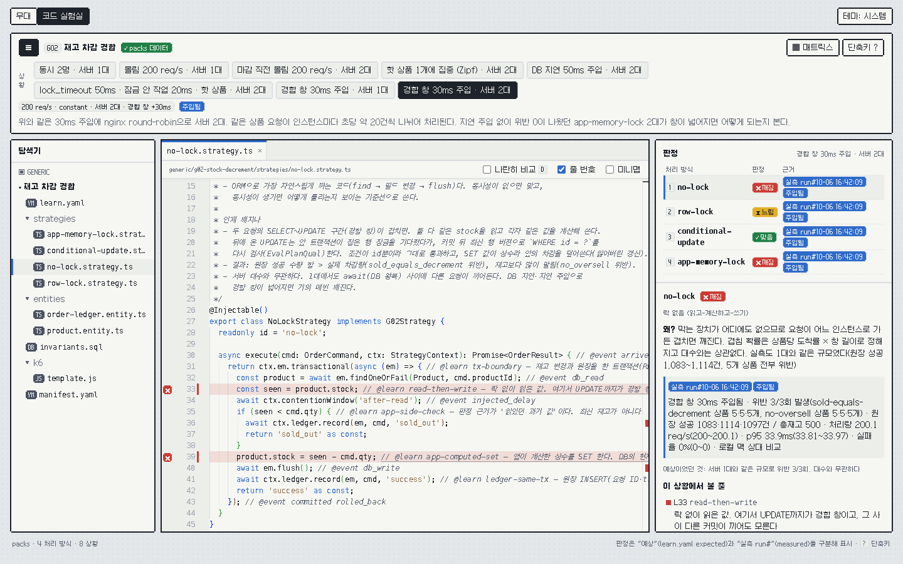
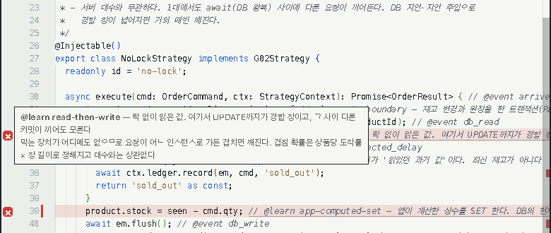
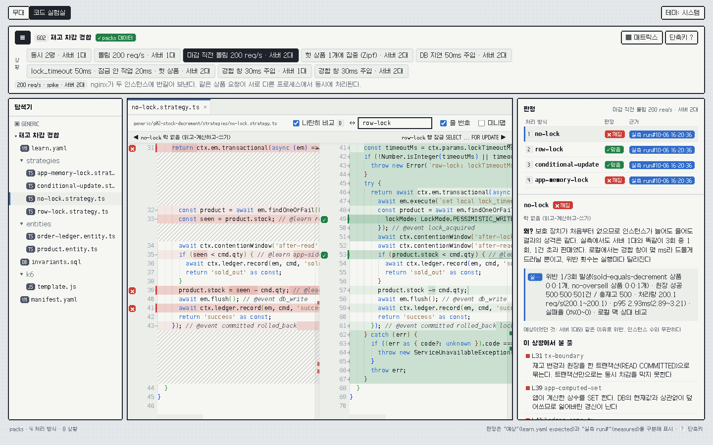
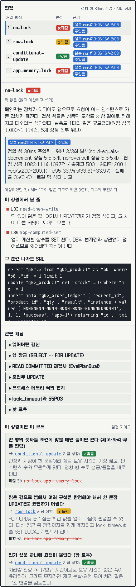
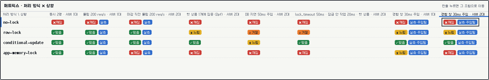
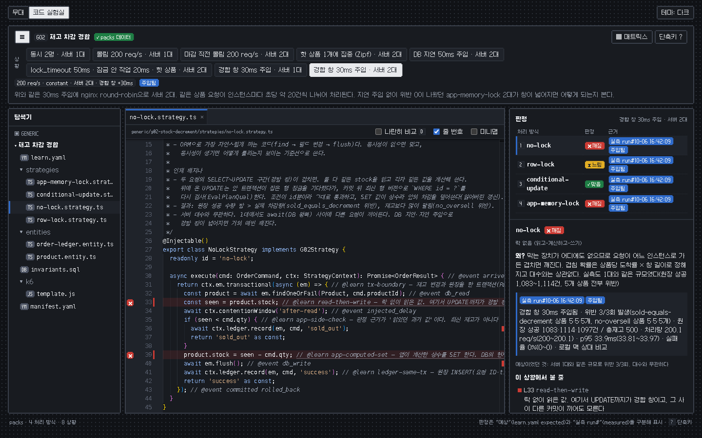
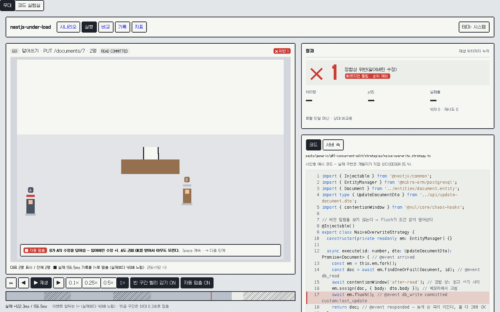
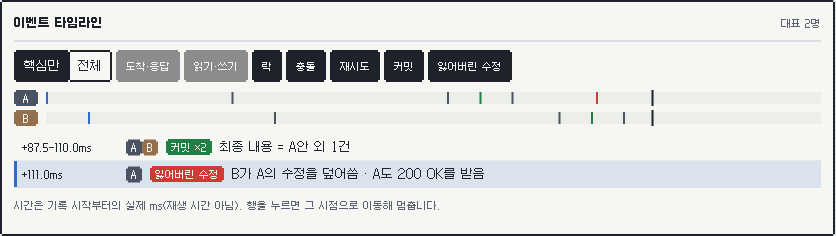
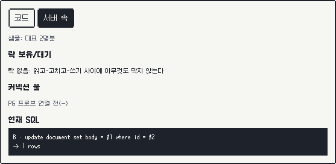
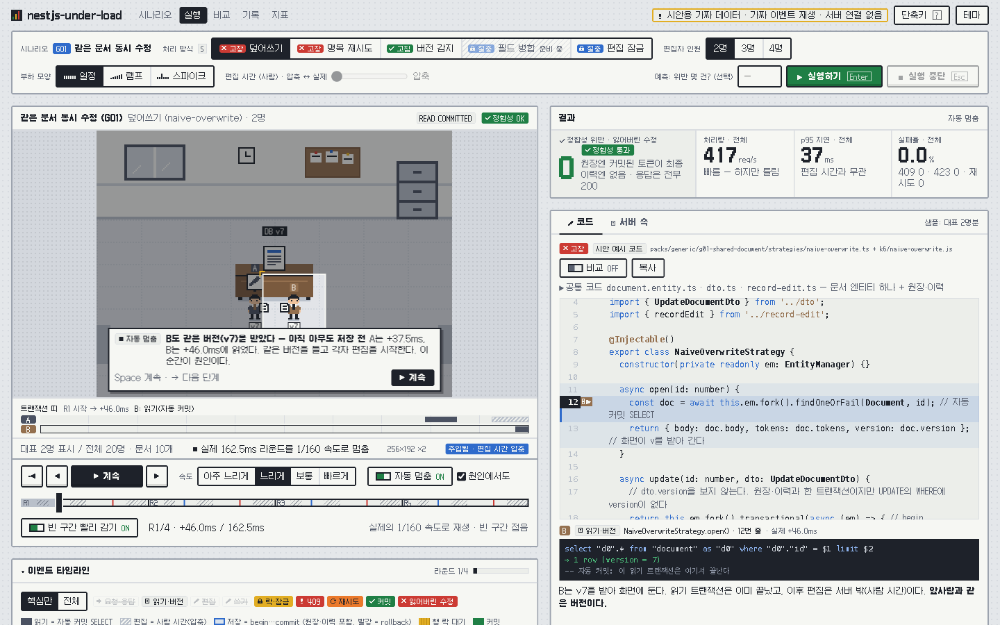

# nestjs-under-load

동시 요청·대량 쓰기·장애 상황에서 서버와 DB 안에서 실제로 무슨 일이 일어나는지 눈으로 보는 로컬 실험실입니다.

같은 API에 **처리 방식(strategy)만 바꿔 가며** 같은 조건에서 부하를 넣고, 정합성(잃어버린 수정, 중복, 초과 판매 등)과 지연·처리량을 나란히 비교합니다. 부하는 [k6](https://k6.io/)로 넣고, 결과는 실험 화면에서 봅니다.



*코드 실험실 — "경합 창 30ms 주입 · 서버 2대" 상황에서 `no-lock`(락 없음) 코드와 판정을 보는 화면. 판정 옆에 "실측"과 "주입됨" 배지가 붙습니다*

> NestJS + MikroORM으로 구현하지만, 다루는 문제(락, 격리 수준, 커넥션 풀, 대량 쓰기, 캐시, 과부하, 비동기 일관성)는 DB·인프라 공통입니다.

## 목차

- [원칙](#원칙)
- [빠른 시작](#빠른-시작)
  - [1. 요구 사항](#1-요구-사항)
  - [2. 설치](#2-설치)
  - [3. 웹 화면만 보기](#3-웹-화면만-보기)
  - [4. 실험 돌리기](#4-실험-돌리기)
  - [5. 정리](#5-정리)
- [화면 보는 법](#화면-보는-법)
  - [코드 실험실](#코드-실험실)
  - [무대(재생)](#무대재생)
  - [디자인 시안](#디자인-시안)
- [결과 읽는 법](#결과-읽는-법)
- [지금 들어 있는 시나리오](#지금-들어-있는-시나리오)
- [로드맵](#로드맵)
- [리포 구조](#리포-구조)
- [라이선스](#라이선스)

## 원칙

- **코드는 AI가, 학습은 사람이.** 처리 코드·불변식 SQL·인프라·화면은 전부 AI가 씁니다. 사람은 코드 실험실에서 "이 부하·상황에는 왜 이 코드가 들어가는가"를 학습하고, 실험 노트(예측 → 실측 → 원인)를 직접 씁니다. 경계는 [DESIGN §5.4](docs/DESIGN.md) 표로 공개합니다.
- **정합성이 먼저다.** 빠르지만 틀린 결과는 순위에서 뺍니다.
- **상대 비교만 말한다.** 로컬 단일 머신의 절대 수치는 운영 용량이 아닙니다. 결과에는 측정 조건을 함께 적습니다.
- **로컬 전용.** 사용자가 편집한 부하 스크립트를 실행하는 구조라서 외부에 노출하지 않습니다. 모든 포트는 `127.0.0.1`에만 열립니다.

## 빠른 시작

웹 화면만 볼 때는 Node와 pnpm만 있으면 됩니다. 실험을 직접 돌릴 때만 Docker가 필요합니다.

### 1. 요구 사항

| 항목 | 버전·사양 | 비고 |
|---|---|---|
| Node.js | 24 이상 | `package.json`의 `engines.node` |
| pnpm | 10 | `corepack enable`로 켜면 `packageManager`에 적힌 버전을 씁니다 |
| Docker Desktop | Compose v2 포함 | 실험 실행에만 필요 |
| Docker 자원 | 8 vCPU / 10GB 이상 권장 | 아래 설명 참고 |

**자원이 부족하면:** 기본 compose 구성 자체가 `minimal` 프로필입니다(app×2, nginx, postgres, k6). Prometheus·Grafana는 `--profile obs`를 줄 때만 뜹니다. 실행 결과에는 `profile: minimal`이 기록됩니다.

**머신 차이:** Apple Silicon은 성능 코어·효율 코어 편차가, Linux 네이티브 Docker는 cpuset 의미 차이가 있습니다. 그래서 결과마다 측정 조건(CPU, Docker vCPU·메모리, 프로필)을 함께 남깁니다.

설치된 버전은 이렇게 확인합니다.

```bash
node -v      # v24.x
pnpm -v      # 10.x
docker compose version
```

### 2. 설치

```bash
git clone https://github.com/sinbox0701/nestjs-under-load.git nestjs-under-load
cd nestjs-under-load
pnpm install
```

예상 출력(마지막 줄):

```
Done in ...ms using pnpm v10.30.2
```

### 3. 웹 화면만 보기

Docker 없이 코드 실험실과 무대를 볼 수 있습니다. 코드 실험실은 저장소의 `packs/**/learn.yaml`과 처리 코드 원문을 빌드 때 읽어 옵니다.

```bash
pnpm --dir web dev
```

예상 출력:

```
  VITE v8.x  ready in ... ms
  ➜  Local:   http://127.0.0.1:5173/
```

- 무대: <http://127.0.0.1:5173/>
- 코드 실험실: <http://127.0.0.1:5173/#lab> (화면 왼쪽 위 탭으로도 바꿀 수 있습니다)

5173 포트가 이미 쓰이고 있으면 Vite가 다음 빈 포트를 고르고, 출력에 그 주소를 보여 줍니다. 포트를 직접 정하려면 `pnpm --dir web dev --port 5190`처럼 붙입니다.

### 4. 실험 돌리기

실험은 `scripts/run.mjs` 하나로 돌립니다. 이 스크립트가 호스트에서 `docker compose`를 불러 아래를 차례로 합니다.

1. app 이미지 빌드, postgres·k6·nginx 기동
2. 실행마다 DB를 템플릿에서 새로 복제(초기화)
3. 처리 방식을 담은 RunConfig를 기록하고 app 재시작
4. k6 웜업(별도 실행) → k6 본 실행
5. 불변식 SQL(`invariants.sql`)로 DB에 남은 사실을 검사
6. 결과를 `runs/<runId>/`에 저장, 같은 조건을 3회 반복

**4-1. 먼저 무엇을 할지 보기(dry-run).** Docker를 부르지 않고 단계와 명령만 출력합니다.

```bash
node scripts/run.mjs --dry-run --strategies no-lock --reps 1
```

예상 출력(앞부분):

```
세션 2026-10-06T16-45-55Z_ebd6: ... (DRY-RUN)
  - no-lock × 앱 2대 × r1

▶ 스택 준비: app 이미지 빌드, postgres·k6·nginx 기동
```

전체 옵션은 `node scripts/run.mjs --help`로 봅니다.

**4-2. (선택) 스택을 미리 띄우기.** `run.mjs`가 필요한 서비스를 알아서 띄우므로 이 단계는 생략해도 됩니다.

```bash
docker compose -f infra/compose/docker-compose.yml up -d --build --wait
```

`--wait`를 주면 서비스가 healthy가 될 때까지 기다렸다가 돌아옵니다(app 2대·nginx·postgres·k6).

DB 비밀번호 등은 로컬 전용 기본값이 들어 있습니다. 바꾸려면 `infra/compose/.env.example`을 `infra/compose/.env`로 복사해 고칩니다.

**4-3. 실험 실행.** 아래 명령은 학습 데이터의 "몰림 200 req/s · 서버 1대"와 "마감 직전 몰림 200 req/s · 서버 2대" 상황에 맞춘 예입니다. 처리 방식 4개 × 앱 1대·2대 × 3회 = 24회를 돌립니다.

```bash
node scripts/run.mjs --rate 200 --duration 20s --warmup 5s --max-vus 2000 --instances 1,2
```

- `--rate 200`: 초당 200건을 일정하게 보냅니다(open model — 응답을 기다리지 않고 정해진 속도로 요청을 넣는 방식).
- `--max-vus 2000`: k6가 동시에 쓸 수 있는 가상 사용자 수 상한입니다. 도착률 × 요청 타임아웃(200 × 10s) 이상이어야 요청을 못 보낸 경우를 "서버가 늦어서"로 셀 수 있습니다. 작으면 그 실행은 "설정 부족"으로 무효가 됩니다.
- 경합 창을 넓혀 보려면 `--inject-delay after-read:30`을 더합니다(읽은 직후 30ms 인위 지연, 결과에 "주입됨"으로 남습니다). 학습 데이터의 "경합 창 30ms 주입" 상황(200 req/s × 20s, 상품 5개 × 재고 100)과 같은 조건이므로, 한 처리 방식·서버 2대·1회만 빠르게 확인하려면 이렇게 돌립니다.

```bash
node scripts/run.mjs --rate 200 --duration 20s --warmup 5s --max-vus 2000 --instances 2 --strategies no-lock --reps 1 --inject-delay after-read:30
```

실행 중에는 `docker compose`·k6 진행 출력이 길게 흐릅니다. 실행마다 마지막에 요약 한 줄이 찍힙니다. 위반이 없으면 `불변식: 모두 통과`로, 있으면 위반 이름과 개수가 나옵니다.

```
    불변식: 모두 통과 | k6 성공 ... 품절 ... 실패 0 드롭 0 | k6 CPU 0.04×limit | 유효
    불변식: 위반 sold-equals-decrement=5, no-oversell=5 | k6 성공 1091 품절 2910 실패 0 드롭 0 | k6 CPU 0.043×limit | 유효
```

(아래 줄이 위 `no-lock` 30ms 주입 명령의 실제 출력입니다.) 끝나면 세션 요약 파일 경로가 나옵니다.

```
완료: 24회 → runs/_sessions/<sessionId>.json
```

위 빠른 확인 명령은 `완료: 1회 → ...`로 끝납니다.

**4-4. 결과 위치.** `runs/`는 git에 올라가지 않는 로컬 산출물입니다.

| 경로 | 내용 |
|---|---|
| `runs/<runId>/metadata.json` | 측정 조건, 불변식 결과, k6 수치, 유효성 판정 |
| `runs/<runId>/summary.json` | k6 원본 요약 |
| `runs/<runId>/run-config.json` | 그 실행에 쓴 RunConfig |
| `runs/_sessions/<sessionId>.json` | 세션 전체 실행 목록 |

`runId`는 `<시각>_g02_<처리 방식>_i<앱 대수>_r<반복 번호>` 형식입니다(예: `2026-10-06T16-20-36Z_g02_no-lock_i2_r1`).

**4-5. 실측을 학습 데이터에 기록.** 세션 결과를 `learn.yaml`의 `measured`에 옮깁니다. 먼저 `--write` 없이 무엇을 쓸지 확인합니다.

```bash
node scripts/measured.mjs --session <sessionId>
```

예상 출력(위 빠른 확인 명령의 세션이라면):

```
- no-lock × contention-window-30-two-instances: 경합 창 30ms 주입됨 · 위반 1/1회 발생(sold-equals-decrement 상품 5개, no-oversell 상품 5개) · 원장 성공 1091건 / 총재고 500 · 처리량 200.1 req/s(...) · p95 34.61ms(...) · 실패율 0%(0~0) · 로컬 맥 상대 비교
(--write 없이 실행: 파일을 바꾸지 않음)
```

전체 24회 세션이면 처리 방식 × 상황 묶음마다 한 줄씩 나오고 `3회`로 집계됩니다. 이 스크립트에는 `--help`가 없습니다(알 수 없는 옵션이라 실패). 옵션은 `--session`, `--write`뿐입니다.

내용이 맞으면 기록합니다.

```bash
node scripts/measured.mjs --session <sessionId> --write
```

조건(앱 대수, 도착률, 데이터 크기, 지연 주입)이 학습 데이터의 상황과 정확히 맞는 묶음만 기록되고, 무효 실행은 집계에서 빠집니다. 같은 상황에 이미 3회 실측이 들어 있으면 `--write`가 그 값을 새 세션 값으로 바꿉니다. 반복 1회짜리 확인 세션은 `--write` 없이 출력만 확인하세요.

**4-6. 웹에서 확인.** 웹 dev 서버를 다시 열거나 새로고침하면, 코드 실험실 판정 패널의 근거 배지가 "예상"에서 "실측 run#…"으로 바뀝니다.

### 5. 정리

```bash
docker compose -f infra/compose/docker-compose.yml down
```

DB 볼륨까지 지우려면 `down -v`를 씁니다. 다음 실행 때 템플릿 DB를 다시 만듭니다.

## 화면 보는 법

웹은 두 화면으로 나뉩니다. 왼쪽 위 탭으로 바꿉니다.

| 화면 | 주소 | 하는 일 |
|---|---|---|
| 코드 실험실 | `/#lab` | 상황별로 어떤 코드가 왜 맞고 틀리는지 읽기 |
| 무대 | `/` | 기록된 처리 단계를 느린 속도로 재생해 보기 |

### 코드 실험실

IDE처럼 생긴 학습 화면입니다. 코드는 읽기 전용입니다.

**구성**

- **탐색기(왼쪽):** 시나리오 폴더 트리입니다. `strategies/`(처리 방식별 코드), `invariants.sql`(정합성 검사), `k6/`(부하 스크립트), `learn.yaml`(학습 데이터)을 열 수 있습니다.
- **상황 선택 바(위):** `learn.yaml`에 정의된 상황(인원, 서버 대수, 지연 주입 조합) 칩입니다. 상황을 바꾸면 판정과 강조 줄이 함께 바뀝니다.
- **에디터(가운데):** 그 상황에서 봐야 할 줄을 빨간 띠와 거터 아이콘으로 강조합니다. 거터 아이콘에 마우스를 올리면 그 줄의 `// @learn` 설명이 뜹니다.
- **판정 패널(오른쪽):** 처리 방식별 판정, 근거 배지, 이유, 실행되는 SQL, 관련 개념, 결정 가이드를 보여 줍니다.
- **매트릭스(아래, `M`):** 처리 방식 × 상황 전체 표입니다.



*`// @learn` 마커 줄에 마우스를 올리면 "락 없이 읽은 값. 여기서 UPDATE까지가 경합 창" 같은 설명이 뜹니다*

**나란히 비교(`D`)** 를 켜면 같은 상황에서 두 처리 방식의 코드를 좌우로 놓습니다. diff가 아니라 "같은 문제를 다르게 푼 두 구현"을 비교하는 용도입니다.



*`no-lock`(읽고-계산하고-쓰기)과 `row-lock`(`SELECT … FOR UPDATE`)을 나란히 비교*

**판정 패널 읽기**



판정 배지는 네 가지입니다.

| 배지 | 뜻 |
|---|---|
| ✓ 맞음 (`ok`) | 정합성이 지켜지고 성능도 문제없음 |
| ✕ 깨짐 (`broken`) | 정합성 위반이 남(초과 판매, 차감 누락 등) |
| ⧗ 느림 (`slow`) | 정합성은 지키지만 대기·지연이 큼 |
| ⊘ 거절 (`rejects`) | 정합성은 지키지만 일부 요청을 거절함(예: 락 대기 시간 초과로 503) |

근거 배지는 그 판정이 어디서 왔는지 알려 줍니다.

- **예상:** 아직 돌려 보지 않았고, PostgreSQL·ORM 동작과 부하 조건에서 추론한 값입니다(`learn.yaml`의 `expected`).
- **실측 run#…:** `run.mjs`로 실제로 돌린 결과입니다(`measured`). 배지에 마우스를 올리면 run id가 보이고, 패널에 3회 범위와 측정 조건이 붙습니다. 예상과 실측이 다르면 "예상이었던 것"을 함께 보여 줍니다.
- **주입됨:** 그 상황이 인위적 지연이나 장애를 넣은 조건이라는 뜻입니다. 자연 상태의 결과와 섞어 읽지 않도록 표시합니다.

그 아래로 차례대로 나옵니다.

- **왜?** 그 판정의 이유
- **이 상황에서 볼 줄:** 누르면 에디터가 그 줄로 이동
- **그 순간 나가는 SQL:** ORM이 실제로 보내는 문장의 예
- **관련 개념:** 잃어버린 갱신, 행 잠금, READ COMMITTED 재검사 등 한 단락 설명
- **이 상황이면 이 코드:** 결정 가이드(쓸 코드 / 피할 코드)

<br clear="right">

**매트릭스**



*매트릭스 — 셀을 누르면 그 상황·처리 방식으로 이동합니다. "실측" 표시가 있는 셀은 실제로 돌려 본 조합이고, "주입됨"이 함께 있으면 지연을 인위로 넣은 조건입니다. 실측이 없는 열(동시 2명, 핫 상품, DB 지연, 짧은 lock_timeout)은 아직 "예상"입니다*

**단축키** (`?`로 도움말을 엽니다. 에디터에 포커스가 있으면 꺼집니다)

| 키 | 동작 |
|---|---|
| `[` / `]` | 이전 / 다음 상황 |
| `J` / `K` | 다음 / 이전 처리 방식 |
| `1` – `9` | 처리 방식 바로 고르기 |
| `D` | 나란히 비교 켜기/끄기 |
| `M` | 매트릭스 보기 |
| `E` | 탐색기 접기/펴기 |
| `?` | 도움말 |
| `Esc` | 도움말 닫기 |

**다크 모드:** 오른쪽 위 "테마" 버튼으로 시스템 → 라이트 → 다크를 돌아가며 고릅니다.



*다크 모드 — "경합 창 30ms 주입 · 서버 2대" 상황. 상황 설명 옆에 "주입됨" 배지가 붙습니다*

### 무대(재생)

실제 처리는 밀리초 단위라 실시간으로는 읽을 수 없습니다. 무대는 기록된 이벤트를 **느린 속도로 재생**합니다. 캐릭터는 기록된 이벤트 사이에서만 움직이고, 이벤트 없이 상태를 바꾸지 않습니다.

> 지금 무대는 G01(같은 문서 동시 수정) "덮어쓰기" 예시 기록을 재생합니다. 실제 실행 기록과의 연결은 1단계 이후 작업입니다.



*자동 멈춤 — B가 A의 수정을 덮어쓴 순간에 멈추고 한 줄 설명을 띄웁니다. 결과 카드는 정합성 위반을 처리량보다 먼저 보여 줍니다*

**재생 컨트롤**

| 컨트롤 | 설명 | 키 |
|---|---|---|
| 재생 / 일시정지 | 자동 멈춤에서 계속할 때도 씁니다 | `Space` |
| 한 단계씩 | 다음 / 이전 이벤트로 이동 | `→` / `←` |
| 처음으로 | | `Home` |
| 재생 속도 | 0.1× · 0.25× · 0.5× · 1×. 1×도 실제보다 40배 느립니다 | `1` – `4` |
| 자동 멈춤 | 충돌·잃어버린 수정·락 대기 같은 핵심 순간에 멈추고 설명을 띄웁니다(기본 ON) | `A` |
| 빈 구간 빨리 감기 | 이벤트가 없는 구간을 최대 0.3초로 접습니다. 접힌 구간은 빗금으로 보입니다(기본 ON) | `F` |

재생 막대 아래에는 "실제 156.5ms 기록을 1×로 멈춤(실제보다 40배 느림)"처럼 **재생 배율과 실제 시간**이 함께 나옵니다.

**이벤트 타임라인.** 처리 단계를 시간순 텍스트로 보여 줍니다. "핵심만 / 전체"로 거르고, 종류(락, 충돌, 커밋, 잃어버린 수정 등)별로 켜고 끕니다. 같은 종류가 이어지면 "×N"으로 묶습니다. 행을 누르면 그 시점으로 이동해 멈춥니다. 시간은 재생 시간이 아니라 실제 ms입니다.



*이벤트 타임라인 — 현재 위치 행(잃어버린 수정)이 강조됩니다*

**서버 속 패널.** 코드 패널 옆 "서버 속" 탭에서 락 보유·대기, 커넥션 풀, 그 순간 나간 SQL과 영향 행 수를 봅니다.



*서버 속 — 덮어쓰기는 락이 없어서 `update … where id = $2`가 그대로 1행을 바꿉니다*

**결과 카드.** 정합성 위반 수가 가장 먼저, 가장 크게 나옵니다. 위반이 있으면 "빠르지만 틀림 · 순위 제외"가 붙고, 처리량·p95·실패율은 그 아래에 둡니다.

### 디자인 시안

`design/mockup.html`은 무대의 완성 모습을 미리 그린 정적 시안입니다. 서버 연결 없이 가짜 데이터·가짜 이벤트로 동작합니다(화면 위에도 그렇게 표시됩니다). 수치는 디자인용이라 실측이 아닙니다.

브라우저로 파일을 직접 열거나, 정적 서버로 엽니다.

```bash
python3 -m http.server 5191 --bind 127.0.0.1 -d design
# http://127.0.0.1:5191/mockup.html
```



*시안의 G01 장면 — "B도 같은 버전(v7)을 받았다"에서 멈춘 모습. 충돌의 결과보다 원인이 먼저 보이게 설계했습니다*

시안에서 볼 것:

- **원인 장면:** "실행하기"를 누르면 두 사람이 **같은 버전을 각각 받는 순간**에서 먼저 멈춥니다("원인에서도" 체크). 그다음에 저장 충돌·덮어쓰기가 이어집니다.
- **처리 방식 비교:** 위 칩에서 덮어쓰기(고장) · 맹목 재시도(고장) · 버전 감지(고침) 등을 바꿔 같은 장면을 다시 돌립니다.
- **트랜잭션 띠:** 무대 아래 띠에서 읽기(자동 커밋 SELECT)와 저장(`begin … commit`)이 서로 다른 트랜잭션임을 봅니다.
- **코드 패널:** 재생 중 이벤트를 낸 줄이 강조되고, 그 순간의 SQL과 영향 행 수가 함께 나옵니다.

## 결과 읽는 법

**위반 0이 곧 안전은 아닙니다.** 로컬은 앱과 DB가 같은 머신에 있어 DB 왕복이 1ms 안팎입니다. 그래서 "읽고 나서 쓰기 전까지"의 경합 창이 좁아, 틀린 코드도 자주 통과합니다. 실제로 G02 `no-lock`은 지연 주입 없이 200 req/s로 3회 돌렸을 때 위반이 1회, 1건만 나왔습니다. 막혀 있는 것이 아니라 드물게 드러난 것입니다. 이럴 때는 `--inject-delay after-read:30`처럼 경합 창을 인위로 넓혀 확인합니다. 이런 결과에는 "주입됨"이 붙습니다.

**30ms 주입 실측(G02, "경합 창 30ms 주입" 상황).** 읽은 직후 30ms를 넣고 같은 조건에서 처리 방식 4개를 3회씩 돌린 값입니다. 판정이 달라지는 지점을 보세요. 지연 주입이 없는 200 req/s에서는 `row-lock`·`app-memory-lock`(서버 1대)이 "맞음"이었는데, 주입 지점이 잠금 안쪽이라 잠금 보유가 30ms를 넘으면서 둘 다 "느림"으로 바뀝니다. `no-lock`은 "깨짐", `app-memory-lock`은 서버 2대에서 "깨짐"으로 남습니다.

| 처리 방식 | 서버 1대 | 서버 2대 |
|---|---|---|
| `no-lock` | 깨짐 · 위반 3/3회 · p95 33.81ms | 깨짐 · 위반 3/3회 · p95 33.9ms |
| `row-lock` | 느림 · 위반 0 · p95 7298.96ms · 실패율 19.77% | 느림 · 위반 0 · p95 5383.44ms · 실패율 15.6% |
| `conditional-update` | 맞음 · 위반 0 · p95 33.94ms | 맞음 · 위반 0 · p95 33.75ms |
| `app-memory-lock` | 느림 · 위반 0 · p95 4672.62ms · 실패율 13.68% | 깨짐 · 위반 3/3회 · p95 107.1ms |

위 값은 모두 `learn.yaml`에 기록된 3회 중앙값입니다. 조건: 로컬 맥(Apple M3 Max, Docker 14 vCPU / 7.7 GiB, profile minimal), 앱 각 cpus 1, postgres cpus 2, nginx round-robin, open 모델 200 req/s × 20s(웜업 5s), 3회 반복, 상품 5개 × 재고 100(균등 분포), 요청당 1개, 경합 창 30ms 주입(after-read), k6 timeout 10s. 서버 2대의 `no-lock`은 원장 성공이 총재고 500을 넘은 1083~1114건이었습니다. 절대 수치가 아니라 같은 조건의 처리 방식끼리 비교하는 용도입니다. "느림"의 실패율은 k6 요청 실패 비율이고, `row-lock`은 `lock_timeout` 503이 0건이라 대기가 길어져 생긴 실패입니다(대기의 대부분이 커넥션 풀 획득).

**상대 비교로만 읽습니다.** 같은 머신·같은 자원 제한·같은 계측 수준에서 "처리 방식 A가 B보다 p95가 낮았다(3회 범위)"처럼 읽습니다. 처리량이나 지연의 절대값을 운영 용량으로 옮기지 않습니다.

> 이 결과는 **로컬 단일 머신**(Docker Desktop VM, CPU·메모리 limit 고정)에서 **처리 방식 간 상대 비교**를 위해 측정한 값입니다. 운영 환경의 처리 용량을 뜻하지 않습니다.

**측정 조건은 결과에 붙어 다닙니다.** 실측 요약에는 머신(CPU, Docker vCPU·메모리), 프로필, 컨테이너별 CPU 제한, 부하 모델과 도착률, 실행 길이, 웜업, 반복 횟수, 데이터 크기·분포가 함께 적힙니다. 조건이 다른 실행끼리는 비교하지 않습니다.

**무효 실행은 결과에서 빠집니다.** `metadata.json`의 `validity`에 판정과 사유가 남습니다.

| 무효 사유 | 판정 기준 | 이유 |
|---|---|---|
| k6 CPU 포화 | 본 실행 구간 평균 CPU가 k6 limit의 0.8배 이상, 또는 스로틀된 주기 비율 0.2 이상 | 부하 발생기가 포화되면 측정한 것은 서버가 아니라 k6입니다 |
| 설정 부족 | 요청을 못 보낸 횟수(`dropped_iterations`) > 0 이면서 `maxVUs` < 도착률 × 요청 타임아웃 | 서버가 늦어서가 아니라 k6 가상 사용자가 모자랐을 수 있습니다 |
| 요청 0건 | k6 요청 수 0 | 실행 자체가 성립하지 않았습니다 |

`maxVUs`가 충분한데도 요청을 못 보냈다면, 그건 서버가 제때 응답하지 못한 결과로 보고 실패 수에 더합니다.

## 지금 들어 있는 시나리오

**G02 재고 차감 경합** (`packs/generic/g02-stock-decrement`) — 같은 주문 API에 처리 방식 4개를 갈아 끼웁니다.

| 처리 방식 | 한 줄 설명 |
|---|---|
| `no-lock` | 락 없이 읽고, 앱에서 계산하고, 씁니다. 동시 요청이 겹치면 한쪽 차감이 사라집니다(기준선) |
| `row-lock` | `SELECT … FOR UPDATE`로 행을 잠그고 차감합니다 |
| `conditional-update` | `UPDATE … SET stock = stock - 1 WHERE id = ? AND stock >= 1` 한 문장으로 판정과 차감을 같이 합니다 |
| `app-memory-lock` | 앱 프로세스 메모리의 mutex로 줄 세웁니다. 서버가 2대 이상이면 서로의 mutex를 못 봅니다 |

상황은 8개입니다(동시 2명, 몰림 200 req/s × 서버 1·2대, 핫 상품 집중, DB 지연, 짧은 lock_timeout, 경합 창 30ms 주입 × 서버 1·2대). 0단계 `run.mjs`는 open model·균등 분포·경합 창 지연 주입만 지원합니다. 그래서 지금 실측이 있는 상황은 몰림 200 req/s(서버 1·2대)와 경합 창 30ms 주입(서버 1·2대)입니다. 30ms 주입 상황에서는 `row-lock`·`app-memory-lock`(서버 1대)의 판정이 "느림"(p95 수 초, 요청 타임아웃 실패 13~20%)으로, `app-memory-lock`(서버 2대)은 "깨짐"으로 나옵니다. 값과 조건은 위 "결과 읽는 법"에 있습니다. closed 모델, Zipf 분포, toxiproxy DB 지연, strategy 파라미터를 바꾸는 상황은 아직 "예상"만 있고, 1단계 실행기에서 다룰 예정입니다.

**G01 같은 문서 동시 수정** — 무대 화면과 디자인 시안에서 장면으로만 보여 줍니다. 처리 코드는 시안용 예시입니다.

## 로드맵

| 단계 | 이름 | 내용 |
|---|---|---|
| 0 (진행 중) | 최소 경로 + 코드 실험실 | G02 4개 처리 방식, `run.mjs`, 코드 실험실 |
| 1 | 기반 | 측정 규율·관측 스택, 실행 설정·비교 화면, G01 |
| 2 | 쓰기·락 | 엔진 추출, 데드락·분산 락·멱등키·대량 쓰기 시나리오 |
| 3 | 과부하·확장 | 커넥션 고갈, PgBouncer, 타임아웃·재시도, 레이트 리밋, 이벤트 루프 블로킹 |
| 4 | 읽기·비동기 | 캐시 스탬피드, 아웃박스, 인덱스·실행계획, 읽기 복제본 |
| 5 | 운영·화면·도구 | 무중단 스키마 변경, 그레이스풀 셧다운, 라이브 무대, 요청 워터폴, k6 편집 |

자세한 완료 기준과 기간 추정은 [ROADMAP.md](docs/ROADMAP.md)에 있습니다.

관련 문서:

- [설계서](docs/DESIGN.md) — 구조, 측정 원칙, 관측, 화면, 학습 데이터 규약
- [시나리오 카탈로그](docs/SCENARIOS.md) — 범용 팩 + 세무 팩(상태 전이·승인 규칙이 많은 업무 도메인 예시)
- [실험 노트 양식](docs/EXPERIMENT_TEMPLATE.md)
- [디자인 시스템](design/DESIGN_SYSTEM.md)

## 리포 구조

```
nestjs-under-load/
├─ apps/app/            실험 대상 NestJS 앱
├─ packs/generic/       시나리오 팩(처리 방식, 불변식 SQL, k6 스크립트, learn.yaml)
├─ infra/compose/       docker compose 구성(모든 포트 127.0.0.1 바인딩)
├─ scripts/             run.mjs(실행기), measured.mjs(실측 → learn.yaml)
├─ web/                 코드 실험실·무대 화면(React + Vite)
├─ design/              디자인 시스템과 무대 시안(mockup.html)
├─ docs/                설계서, 로드맵, 시나리오 카탈로그, 실험 노트
└─ runs/                실행 결과(로컬 전용, git 제외)
```

## 라이선스

[MIT](LICENSE)
